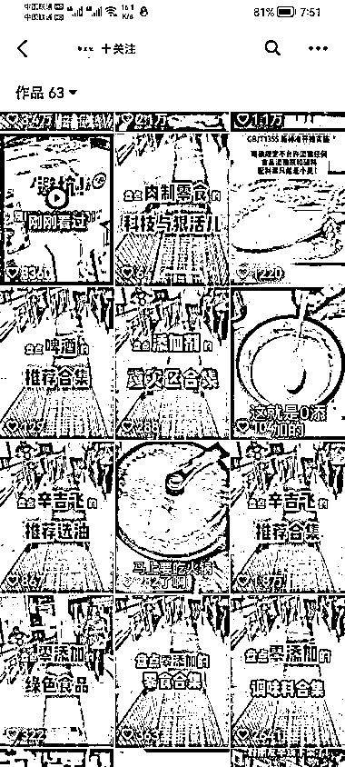

# 零添加食品带货

> 原文：[`www.yuque.com/for_lazy/xkrm14/oy9nlztl1n4t63q3`](https://www.yuque.com/for_lazy/xkrm14/oy9nlztl1n4t63q3)

作者： 阿丰 

日期：2023-01-28 

点赞数：17 

项目：零添加食品带货 背景：去年辛吉飞的一系列视频，让很多人知道了不少“科技与狠活”，也觉醒了零添加食品的意识。某些零添加食品比如某某酱油，当时都卖脱销了。 内容：几个镜头，拍一个超市入口视频，然后几张产品照片 数据：63 个视频，粉丝量 5.4 万，带货 9000 多件，客单价 9.9 到 100 多不等，几十块的居多。按一个低价 30 块，佣金 10%计算，也是将近 10 万收入。 

  

  

  

