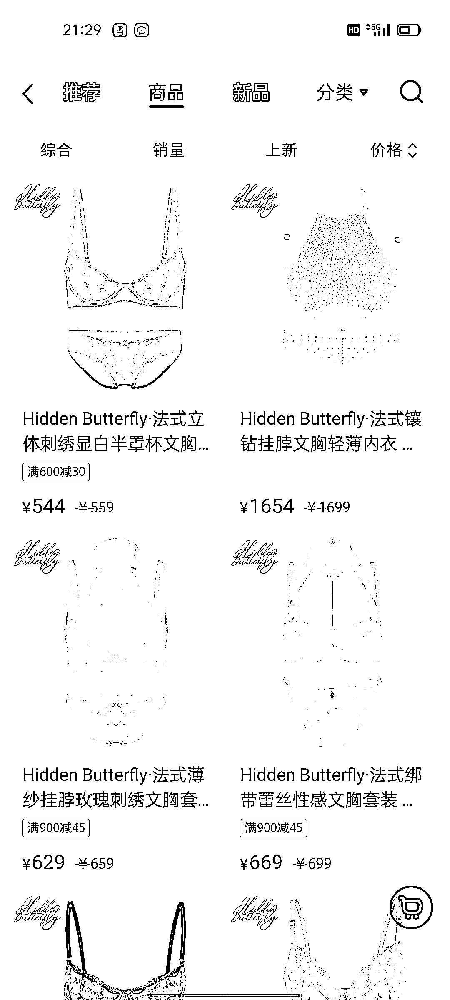

# 小红书上的私人物品可以卖到很贵，有其他平台所不具备的优势，女性占比 90%

> 原文：[`www.yuque.com/for_lazy/xkrm14/kra9gtd0dadizhol`](https://www.yuque.com/for_lazy/xkrm14/kra9gtd0dadizhol)

作者： 明月几时有 

日期：2023-01-28 

点赞数：16 

小红书上的私人物品可以卖到很贵，有其他平台所不具备的优势，女性占比 90%，北上广深一线白领占比大多数，月活流量也达到了 2 亿，利润也大的离谱，销量也不差。 （生财社群只讲搞钱，不要带有私人其他想法） #风向标 

 

 

 

 

