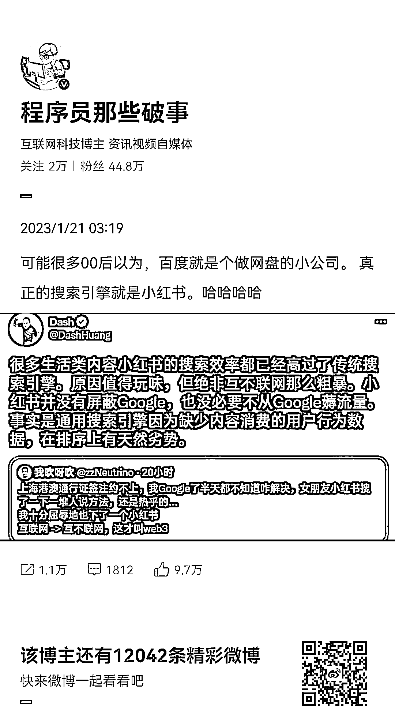
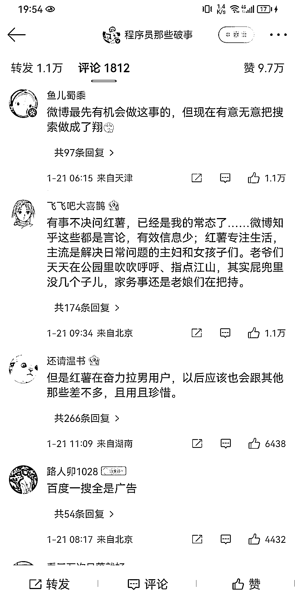

# 带有启迪性的风向标——把小红书做成搜索引擎

> 原文：[`www.yuque.com/for_lazy/xkrm14/mefi239x32vtkvr6`](https://www.yuque.com/for_lazy/xkrm14/mefi239x32vtkvr6)

<ne-p id="u9c923135" data-lake-id="u9c923135"><ne-text id="u9313074a">作者： 波本零</ne-text></ne-p> <ne-p id="u120d9519" data-lake-id="u120d9519"><ne-text id="u9c51c1f1">日期：2023-01-25</ne-text></ne-p> <ne-p id="u59ad8cd6" data-lake-id="u59ad8cd6"><ne-text id="uce4f10cf">点赞数：</ne-text><ne-text id="u436b03f9" ne-bold="true">31</ne-text></ne-p> <ne-hole id="u05ec6a1a" data-lake-id="u05ec6a1a"><ne-card data-card-name="hr" data-card-type="block" id="sN6zw" data-event-boundary="card"><ne-p id="u7042bf00" data-lake-id="u7042bf00"><ne-text id="ued8c6bcc">带有启迪性的风向标——把小红书做成搜索引擎。</ne-text> <ne-text id="u9b92f311">发帖的时候，尽量去想自己的帖子是不是别人愿意去搜索的答案？用户搜到你是不是愿意把你当成宝藏百科全书？同理抖音也可以这么做。</ne-text> <ne-text id="u3665cde8">如果不知道自己的帖子可以怎么做的话，可以在 5118 上提前去看用户最关心哪些问题，把答案做成合集发在小红书/抖音，然后再集合成电子书进行私域引流。</ne-text></ne-p> <ne-p id="uaebc5fed" data-lake-id="uaebc5fed"><ne-card data-card-name="image" data-card-type="inline" id="Mv9gG" data-event-boundary="card"></ne-card></ne-p> <ne-p id="u9f40cee1" data-lake-id="u9f40cee1"><ne-card data-card-name="image" data-card-type="inline" id="doML7" data-event-boundary="card"></ne-card></ne-p> <ne-hole id="u8162c29d" data-lake-id="u8162c29d"><ne-card data-card-name="hr" data-card-type="block" id="jkJCg" data-event-boundary="card"><ne-p id="u8f20b97f" data-lake-id="u8f20b97f"><ne-text id="u46d61a95">公众号懒人找资源，懒人专属群分享</ne-text></ne-p></ne-card></ne-hole></ne-card></ne-hole>