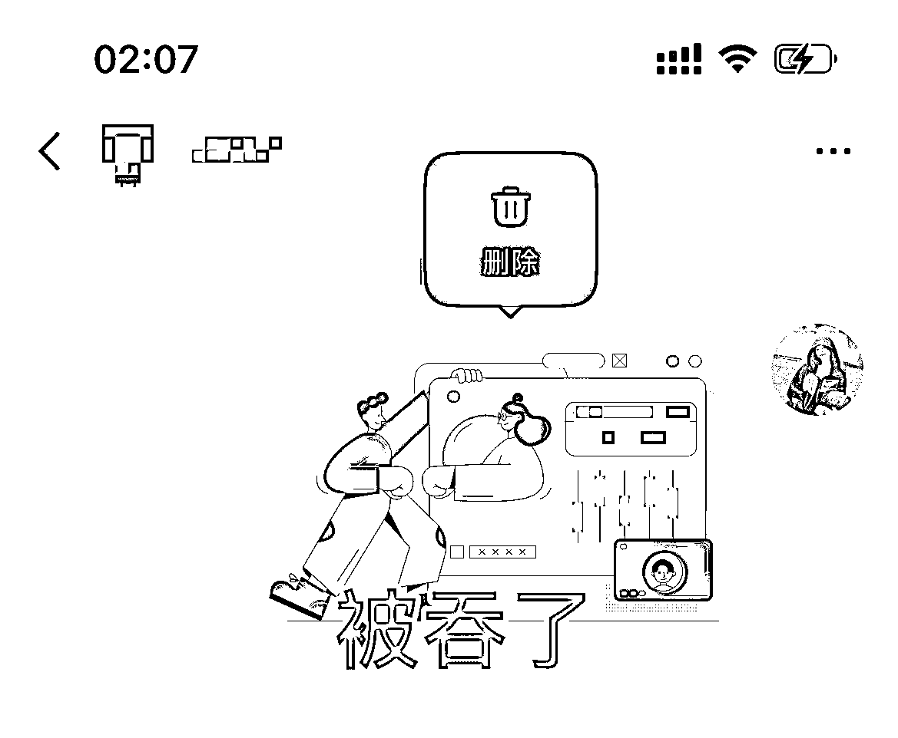

# 小红书引流图被吞问题，发出引流图后长按，有撤回表示发送成功

> 原文：[`www.yuque.com/for_lazy/xkrm14/tvvnm0wpkgroy958`](https://www.yuque.com/for_lazy/xkrm14/tvvnm0wpkgroy958)

<ne-p id="u57fdb4b3" data-lake-id="u57fdb4b3"><ne-text id="uc0f31164">作者： iMairy</ne-text></ne-p> <ne-p id="ufc7bfa5d" data-lake-id="ufc7bfa5d"><ne-text id="ud2a741cf">日期：2023-01-21</ne-text></ne-p> <ne-p id="u78e8be33" data-lake-id="u78e8be33"><ne-text id="u98225894">点赞数：</ne-text><ne-text id="u13cb0531" ne-bold="true">50</ne-text></ne-p> <ne-hole id="u733cd0ab" data-lake-id="u733cd0ab"><ne-card data-card-name="hr" data-card-type="block" id="HrJbM" data-event-boundary="card"><ne-p id="u34ab0947" data-lake-id="u34ab0947"><ne-text id="u738f7a3b">今天看到炮爷文章里提到小红书引流图被吞问题，刚好也遇到。测试后无意间发现一个规律，发出引流图后，在引流图上长按，有撤回表示发送成功，反之被吞</ne-text></ne-p> <ne-p id="u7013c9a5" data-lake-id="u7013c9a5"><ne-card data-card-name="image" data-card-type="inline" id="RzzAS" data-event-boundary="card"></ne-card></ne-p> <ne-p id="ua9674706" data-lake-id="ua9674706"><ne-card data-card-name="image" data-card-type="inline" id="gB9Go" data-event-boundary="card"></ne-card></ne-p> <ne-hole id="ua529bdaa" data-lake-id="ua529bdaa"><ne-card data-card-name="hr" data-card-type="block" id="Xy5lr" data-event-boundary="card"><ne-p id="ud187293b" data-lake-id="ud187293b"><ne-text id="uda6f41ee">公众号懒人找资源，懒人专属群分享</ne-text></ne-p></ne-card></ne-hole></ne-card></ne-hole>