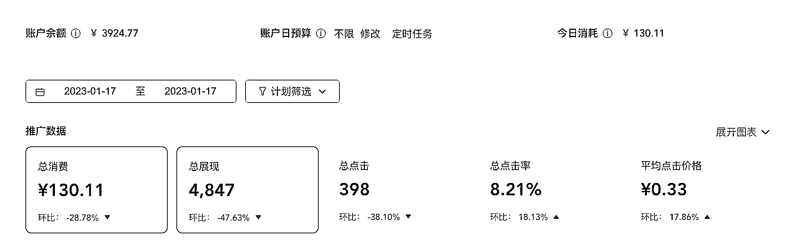

# 如果你有一个好的业务或者产品承接，一定要去试试看小红书聚光平台

> 原文：[`www.yuque.com/for_lazy/xkrm14/mhpldblrdvrto28g`](https://www.yuque.com/for_lazy/xkrm14/mhpldblrdvrto28g)

<ne-p id="u202a7cce" data-lake-id="u202a7cce"><ne-text id="uaf0c5452">作者： 麦洛</ne-text></ne-p> <ne-p id="u5b60613c" data-lake-id="u5b60613c"><ne-text id="u2730ea87">日期：2023-01-17</ne-text></ne-p> <ne-p id="uc2d7887a" data-lake-id="uc2d7887a"><ne-text id="ucf51db80">点赞数：</ne-text><ne-text id="u6de35fe0" ne-bold="true">33</ne-text></ne-p> <ne-hole id="ufe474412" data-lake-id="ufe474412"><ne-card data-card-name="hr" data-card-type="block" id="t7fdq" data-event-boundary="card"><ne-p id="u342640c6" data-lake-id="u342640c6"><ne-text id="u7f57c4e5">小红书聚光平台搜索广告 最近试了一下小红书聚光平台投搜索广告，对于我的业务来说，算是很有帮助的。单个点击在 0.3 元左右（原来</ne-text> <ne-text id="u036221e1">0.27，最近涨了不少），虽然每天消耗不多，但是我 ROI 在 100 左右[得意] 我一个业余项目，小红书跑了 1 个多月了，很稳定。目前 1 个人，一年</ne-text> <ne-text id="u9446996b">100w+ 纯利润没有问题（聚光占了很大的功劳） 给大家的建议是： 1、如果你有一个好的业务或者产品承接，一定要去试试看小红书聚光平台</ne-text> <ne-text id="ucfdb7ad1">2、在聚光投广告的朋友，想办法弄出各种测试用例，频繁的测试人群，出价等数据，找到 ROI 最高的计划，猛投 3、客单价高的，更适合去投聚光。高客单才有高</ne-text> <ne-text id="uc9df5588">ROI 大家别问我做的是啥业务了，我应该不太会说 小红书聚光，我也没有玩明白，也没有更多教程 大家要是感兴趣，可以去找靠谱的小红书商务咨询聚光开户的事情</ne-text></ne-p> <ne-p id="u18dd15ae" data-lake-id="u18dd15ae"><ne-card data-card-name="image" data-card-type="inline" id="BNttX" data-event-boundary="card">  <ne-hole id="u822b904a" data-lake-id="u822b904a"><ne-card data-card-name="hr" data-card-type="block" id="auPwY" data-event-boundary="card"><ne-p id="u3bdc2931" data-lake-id="u3bdc2931"><ne-text id="u18c104d9">公众号懒人找资源，懒人专属群分享</ne-text></ne-p></ne-card></ne-hole></ne-card></ne-p></ne-card></ne-hole>