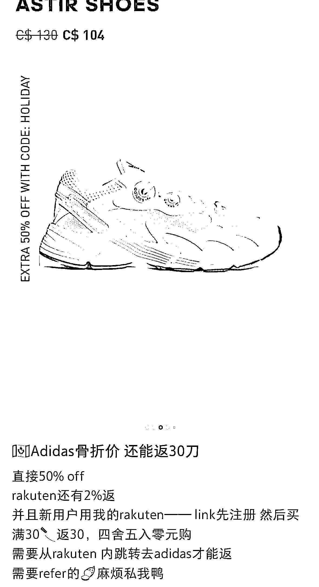
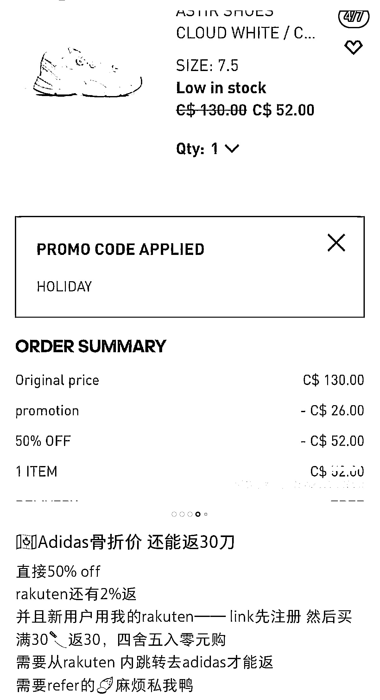

# 国外返利网站拉新方式

> 原文：[`www.yuque.com/for_lazy/xkrm14/ql5i6lvovtl7swfa`](https://www.yuque.com/for_lazy/xkrm14/ql5i6lvovtl7swfa)

<ne-p id="uf92307cd" data-lake-id="uf92307cd"><ne-text id="uf9112fe2">作者： 米笠</ne-text></ne-p> <ne-p id="ub815d3b7" data-lake-id="ub815d3b7"><ne-text id="u50c2c9ae">日期：2023-01-17</ne-text></ne-p> <ne-p id="u852eb91d" data-lake-id="u852eb91d"><ne-text id="uabb35ba0">点赞数：</ne-text><ne-text id="u75ed40c4" ne-bold="true">23</ne-text></ne-p> <ne-hole id="u6b93e301" data-lake-id="u6b93e301"><ne-card data-card-name="hr" data-card-type="block" id="ykDIz" data-event-boundary="card"><ne-p id="u72a8d30e" data-lake-id="u72a8d30e"><ne-text id="u411892d9">国外返利网站拉新方式 上条风向标，国外拉新网站一般有 200-300 人民币的拉新奖励。 但需要被推荐人购买大概 30 刀的物品，奖励才生效。 操作思路：</ne-text> <ne-text id="u995e2f3c">找一款优惠比较大的，品牌鞋服。 在小红书或 TikTok 发布笔记或视频 直接给客户做好选择 邀请用户使用返利网站的优惠链接购买。</ne-text> <ne-text id="u8e7ff2a5">顾客低成本购物，推广者获得拉新奖励。</ne-text></ne-p> <ne-p id="u68006492" data-lake-id="u68006492"><ne-card data-card-name="image" data-card-type="inline" id="v4pQP" data-event-boundary="card"></ne-card></ne-p> <ne-p id="u03aec8fa" data-lake-id="u03aec8fa"><ne-card data-card-name="image" data-card-type="inline" id="fvYMo" data-event-boundary="card"></ne-card></ne-p> <ne-hole id="uc5b3bf17" data-lake-id="uc5b3bf17"><ne-card data-card-name="hr" data-card-type="block" id="r2tEg" data-event-boundary="card"><ne-p id="u554d2930" data-lake-id="u554d2930"><ne-text id="u00035bd9">公众号懒人找资源，懒人专属群分享</ne-text></ne-p></ne-card></ne-hole></ne-card></ne-hole>