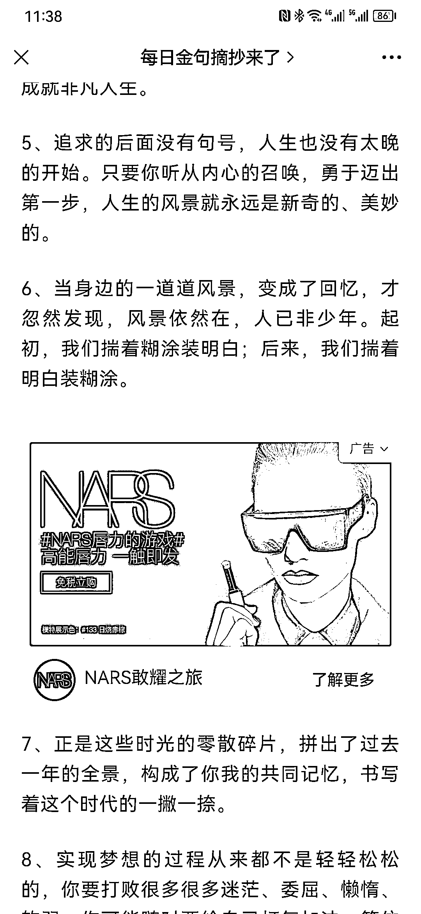
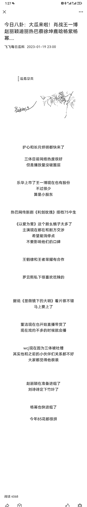

# 公众号蹭机构、名人的 IP，每天发文的标题都不变

> 原文：[`www.yuque.com/for_lazy/xkrm14/zh0if9bb2wmllwqr`](https://www.yuque.com/for_lazy/xkrm14/zh0if9bb2wmllwqr)

作者： 鱼 

日期：2023-01-20 

点赞数：17 

公众号标题党，蹭机构、名人的 IP，每天发文的标题都不变，点进去看，文章内容都很水，但每日流量都是稳定的三四千。 启发：借势出击很重要（心灵鸡汤式的文案没人看，人民日报出的鸡汤就有人看了），坚持、重复地做下去很重要，让读者一点点养成打开阅读习惯。 

 

 

 

 

