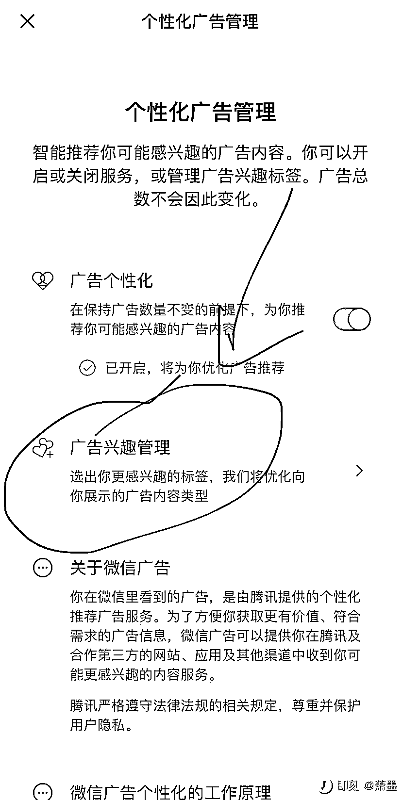

# 可以设置微信里屏蔽广告

> 原文：[`www.yuque.com/for_lazy/xkrm14/dxn31sp8nm2n2qmo`](https://www.yuque.com/for_lazy/xkrm14/dxn31sp8nm2n2qmo)

作者： 炮爷(以前叫樱木) 

日期：2023-01-17 

点赞数：16 

如何让微信里广告不那么烦人。 设置→个人信息与权限→个性化广告管理→广告兴趣管理 把不想出现的品类禁用掉，特别是游戏和培训。 不过，我建议不要都禁掉，要学会看广告，记得曹大、顾小北老师文章中都说过这事儿，想要赚钱，就要学会看广告，保持商业敏感性。 

  

 

 

