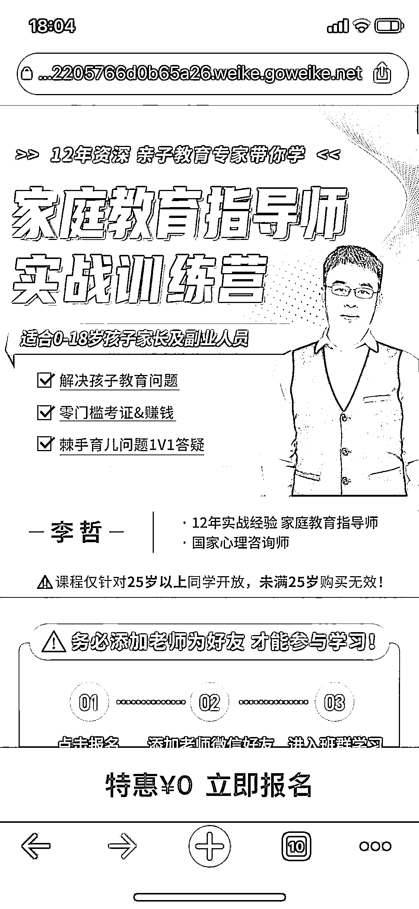
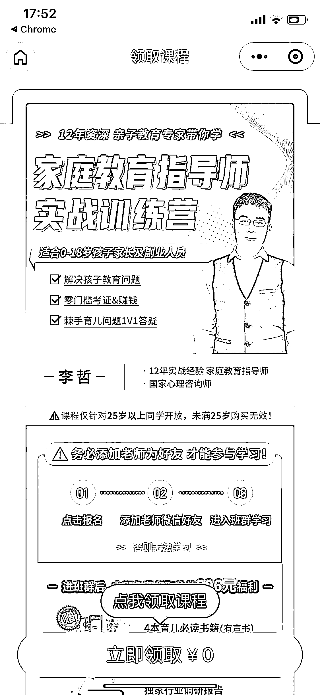

# 网页直接跳转微信小程序的案例

> 原文：[`www.yuque.com/for_lazy/xkrm14/eoospfce0h4n6s8s`](https://www.yuque.com/for_lazy/xkrm14/eoospfce0h4n6s8s)

作者： one 先生 

日期：2023-01-16 

点赞数：17 

网页直接跳转微信小程序的案例来了， 发带有链接的营销短信，点击链接直接经过浏览器自动跳转微信小程序，然后可以加企业微信， 体验了下，步骤非常的丝滑~ 对于那些手里有很多还没加微信的客户，低成本的“诱之以利”下，应该可以方便的加上微信了。 

 

 

 

 

