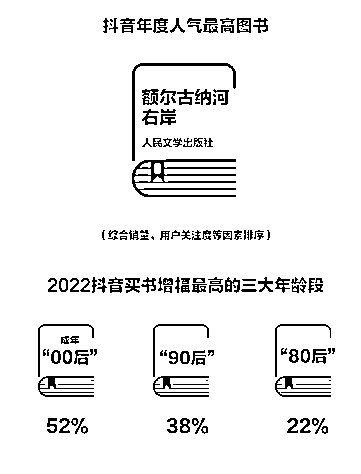

# 抖音买书增幅最大的人群是 00 后

> 原文：[`www.yuque.com/for_lazy/xkrm14/fqoxcng82zq8pgx6`](https://www.yuque.com/for_lazy/xkrm14/fqoxcng82zq8pgx6)

<ne-p id="u7983a24c" data-lake-id="u7983a24c"><ne-text id="u400e591f">作者： 大王</ne-text></ne-p> <ne-p id="u254a528d" data-lake-id="u254a528d"><ne-text id="u091438f4">日期：2023-01-17</ne-text></ne-p> <ne-p id="ud27bba38" data-lake-id="ud27bba38"><ne-text id="u5b116c8d">点赞数：</ne-text><ne-text id="uf280e05b" ne-bold="true">25</ne-text></ne-p> <ne-hole id="uee9c828a" data-lake-id="uee9c828a"><ne-card data-card-name="hr" data-card-type="block" id="eHOXa" data-event-boundary="card"><ne-p id="u1bfb6524" data-lake-id="u1bfb6524"><ne-text id="u2f6ea04d">抖音买书增幅最大的人群是多少岁？ 结果挺出人意料，是 00 后。书单号的同学需要考虑下自己的受众了。</ne-text></ne-p> <ne-p id="ub88d8cca" data-lake-id="ub88d8cca"><ne-card data-card-name="image" data-card-type="inline" id="iewkj" data-event-boundary="card"></ne-card></ne-p> <ne-hole id="ua32668e1" data-lake-id="ua32668e1"><ne-card data-card-name="hr" data-card-type="block" id="YCnW0" data-event-boundary="card"><ne-p id="ue08e062e" data-lake-id="ue08e062e"><ne-text id="u259b7a69">公众号懒人找资源，懒人专属群分享</ne-text></ne-p></ne-card></ne-hole></ne-card></ne-hole>