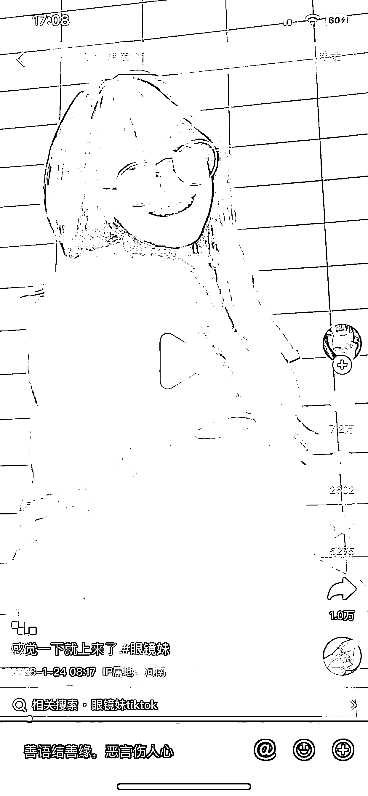
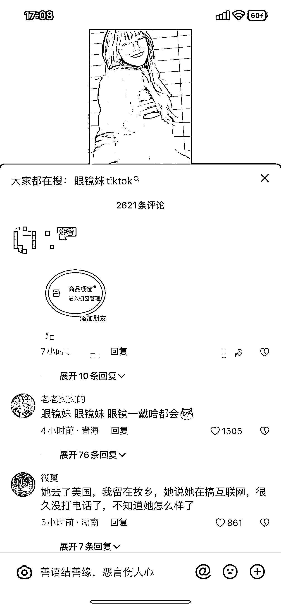

# 用 TikTok 视频在抖音卖教程 ，适合批量复制

> 原文：[`www.yuque.com/for_lazy/xkrm14/wog4zz9eh24q4qbz`](https://www.yuque.com/for_lazy/xkrm14/wog4zz9eh24q4qbz)

作者： 石头 LEO 

日期：2023-01-24 

点赞数：22 

搬运 TikTok 视频卖教程 适合批量复制 TikTok 搬运党的福利，以前搬运 TikTok 视频到抖音，起号很快(很容易爆)，但是变现很差。几十万上百万播放 0 收益的很多。 目前这种搬运视频+橱窗卖教程的方式 简单有效。 尤其适合批量复制。 如下图这个博主，单价 29.9 的教程，30 天卖出 420 份 合计:12558 元 做过搬运类的圈友应该都知道这类账号 ，单个账号的日常花费时间不高。熟练之后一次几分钟就够了。 批量操作可行。 延伸思考 1、引流到私域 2、开个抖店，把那些不会变现的搬运账号联系一遍，叫他们带你的教程。 3、除了搬运美女类视频，还有哪些类型的视频 看了以后还想看更多的。想看更多就得安装。这样矩阵的时候避免内容同质化 4、内容形式升级，更多形式的可能性。 比如小红书标题：姐妹们我又发现一个宝藏博主巴拉巴拉.. 通过盘点海外小众博主的方式吸粉，想自己去看的之前又不会弄的，会自己买教程。相信“偶像”的力量 5、是否可低成本签约素人博主 进而有更大可玩性 （如：独家内容） 可能遇到的问题 星球内都能找到 :) 

 

 

 

 

 

