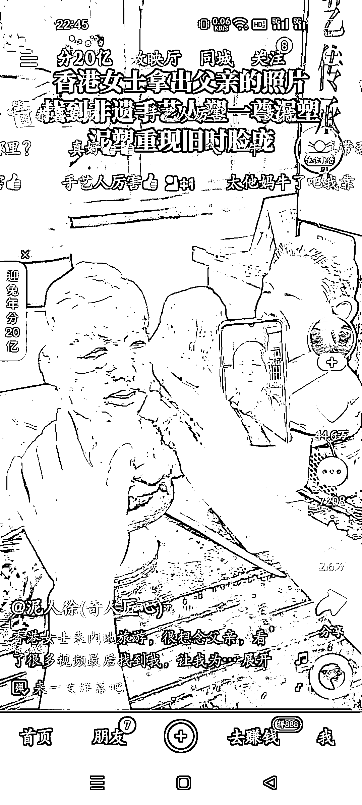
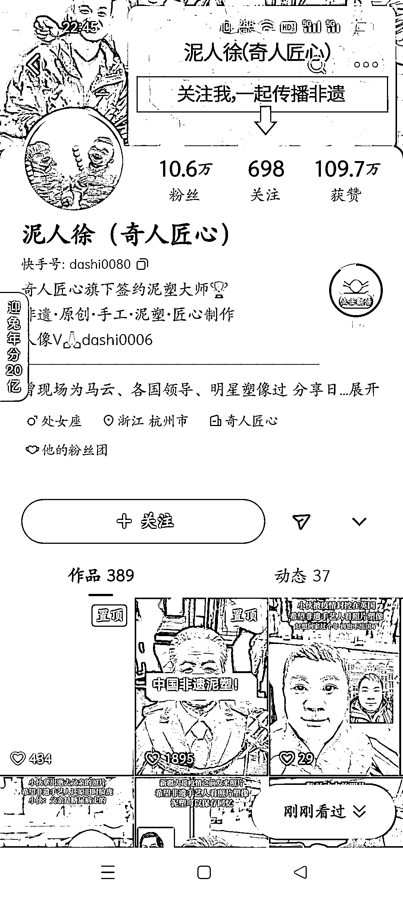

# 手艺人捏老人雕像，很多人怀旧，拿老人照片去搞个雕塑

> 原文：[`www.yuque.com/for_lazy/xkrm14/lera178gkq5iwvbm`](https://www.yuque.com/for_lazy/xkrm14/lera178gkq5iwvbm)

<ne-p id="udd8a1aef" data-lake-id="udd8a1aef"><ne-text id="u1835b565">作者： a'ゞ初夏の约定</ne-text></ne-p> <ne-p id="ue2580a53" data-lake-id="ue2580a53"><ne-text id="u006a712f">日期：2023-01-17</ne-text></ne-p> <ne-p id="ue0959da5" data-lake-id="ue0959da5"><ne-text id="ud9f22d53">点赞数：</ne-text><ne-text id="u64fff203" ne-bold="true">26</ne-text></ne-p> <ne-hole id="ub0f6cfad" data-lake-id="ub0f6cfad"><ne-card data-card-name="hr" data-card-type="block" id="CAMwF" data-event-boundary="card"><ne-p id="ua4b35d73" data-lake-id="ua4b35d73"><ne-text id="uf3fb1d2e">手艺人捏老人雕像 很多人怀旧，拿老人照片去搞个雕塑，利用人选那种感情很难分割，评论区很多人询问，就是想念家人的老人。</ne-text> <ne-text id="ua83f5705">变现方式：可以联系周边或是其他渠道匠人尝试合作，打感情牌永远是满足市场需求的</ne-text></ne-p> <ne-p id="u167f7348" data-lake-id="u167f7348"><ne-card data-card-name="image" data-card-type="inline" id="hNBzf" data-event-boundary="card"></ne-card></ne-p> <ne-p id="u45c9288f" data-lake-id="u45c9288f"><ne-card data-card-name="image" data-card-type="inline" id="taMBD" data-event-boundary="card"></ne-card></ne-p> <ne-p id="u56da03b3" data-lake-id="u56da03b3"><ne-card data-card-name="image" data-card-type="inline" id="yg8JQ" data-event-boundary="card"></ne-card></ne-p> <ne-hole id="ud909727c" data-lake-id="ud909727c"><ne-card data-card-name="hr" data-card-type="block" id="rmO1n" data-event-boundary="card"><ne-p id="u18e6e21c" data-lake-id="u18e6e21c"><ne-text id="u8562081c">公众号懒人找资源，懒人专属群分享</ne-text></ne-p></ne-card></ne-hole></ne-card></ne-hole>