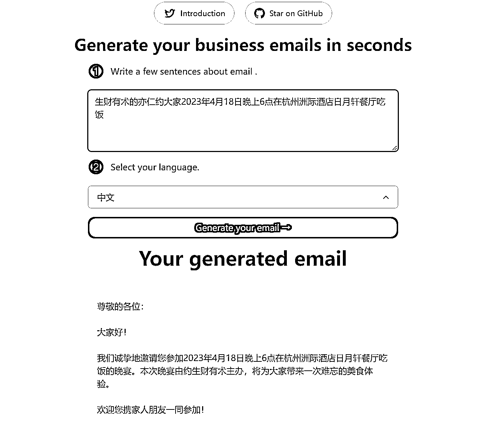

# 使用 AI 撰写邮件

> 原文：[`www.yuque.com/for_lazy/xkrm14/ogdpgkagen6lhk9e`](https://www.yuque.com/for_lazy/xkrm14/ogdpgkagen6lhk9e)

<ne-p id="ub9e2394d" data-lake-id="ub9e2394d"><ne-text id="uafa39333">作者： 张云金 _GISer</ne-text></ne-p> <ne-p id="u16bf8d79" data-lake-id="u16bf8d79"><ne-text id="ud07fc98f">日期：2023-01-29</ne-text></ne-p> <ne-p id="ub86c163b" data-lake-id="ub86c163b"><ne-text id="uab91605c">点赞数：</ne-text><ne-text id="u66bee7b3" ne-bold="true">12</ne-text></ne-p> <ne-hole id="ue1a83d2b" data-lake-id="ue1a83d2b"><ne-card data-card-name="hr" data-card-type="block" id="UY9tv" data-event-boundary="card"><ne-p id="u9f505490" data-lake-id="u9f505490"><ne-text id="u4bf2083a">使用 AI 撰写邮件 email-helper.vercel.app</ne-text></ne-p> <ne-p id="ud400c8a3" data-lake-id="ud400c8a3"><ne-card data-card-name="image" data-card-type="inline" id="EsHxc" data-event-boundary="card"></ne-card></ne-p> <ne-p id="u36667ee7" data-lake-id="u36667ee7"><ne-card data-card-name="image" data-card-type="inline" id="sfrs8" data-event-boundary="card"></ne-card></ne-p> <ne-hole id="u1c168cc0" data-lake-id="u1c168cc0"><ne-card data-card-name="hr" data-card-type="block" id="lyTHT" data-event-boundary="card"><ne-p id="uf2bc6878" data-lake-id="uf2bc6878"><ne-text id="uf447761d">公众号懒人找资源，懒人专属群分享</ne-text></ne-p></ne-card></ne-hole></ne-card></ne-hole>