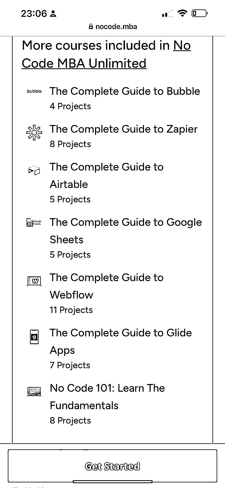
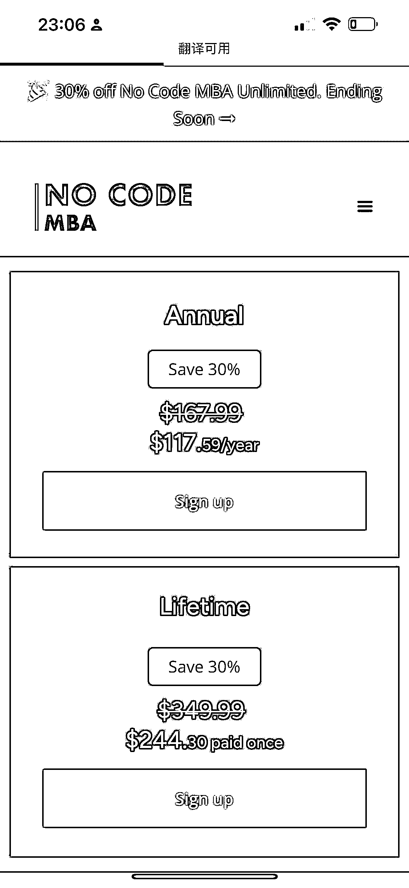

# 普通人如何基于 ChatGPT 等人工智能来做一些简单应用的课程，在 twitter 上投广告，国内可以复制课程

> 原文：[`www.yuque.com/for_lazy/xkrm14/qu35y686psse5t8k`](https://www.yuque.com/for_lazy/xkrm14/qu35y686psse5t8k)

作者： 标叔 

日期：2023-01-29 

点赞数：25 

普通人如何基于 chatgpt 等人工智能来做一些简单应用的课程，在 twitter 上投广告，国内可以复制课程，在公众号和抖音投广告卖课程与训练营。 年度定价 120 刀，终身定价 250 刀。 1\. 如何用 GPT-3 建立一个 Al 作家 2.如何使用 DALLE-2 构建图像生成器 3\. 如何使用 Stable Diffusion 构建图像生成器 4\. 如何连接到 Open AI 的 api 5\. 如何使用 Bubble's api 连接器 6. 如何在 Bubble 中构建连接到 Al 的输入表单 7\. 如何使用 Al 编写可以在应用程序中使用的提示词 8\. 如何在各种用途中使用 Al 9. 如何使用构建自己的应用程序 

 

 

 

  

 

