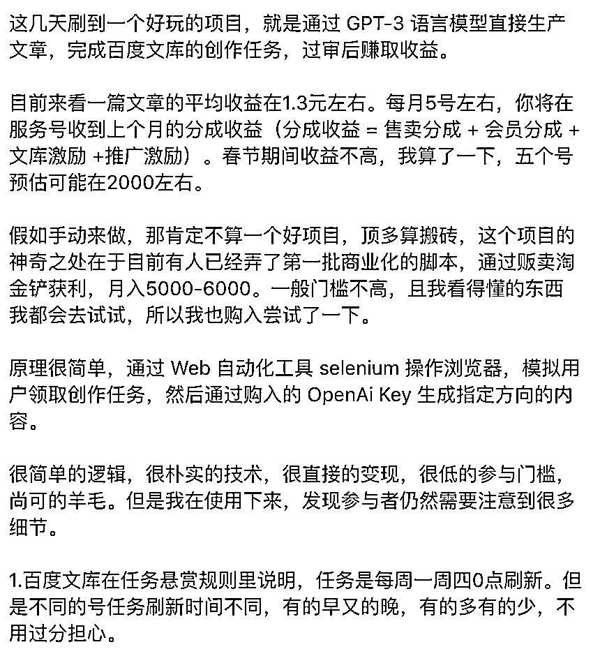
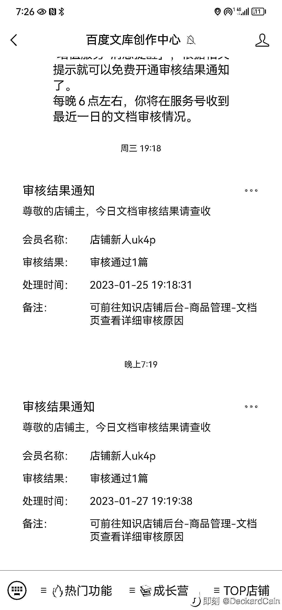
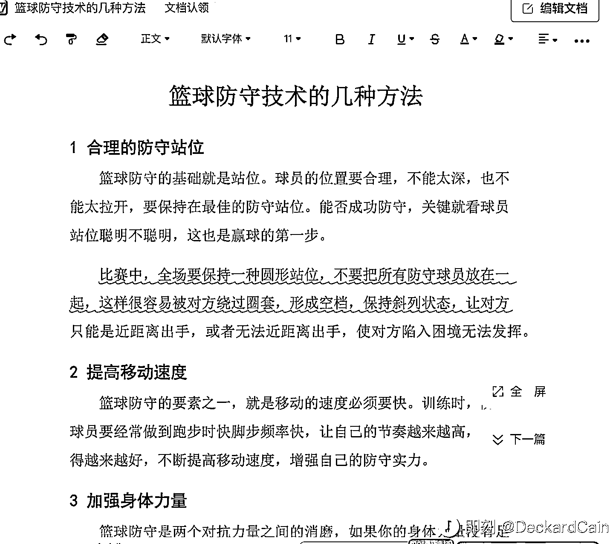

# 百度文库使用 ChatGPT 回答，3 种变现方式

> 原文：[`www.yuque.com/for_lazy/xkrm14/nd8rggvw3cowqd2v`](https://www.yuque.com/for_lazy/xkrm14/nd8rggvw3cowqd2v)

作者： 码叔编程 

日期：2023-01-28 

点赞数：18 

百度文库使用 ChatGPT 回答，3 种变现方式： 1、赚百度文库分成收益 = 售卖分成 + 会员分成 +文库激励 +推广激励 2、有人弄了第一批商业化的脚本，通过贩卖淘金铲获利，月入 5000-6000。 3、有人把这个打包成一个赚钱项目，开训练营，招学员盈利。 

 

 

 

 

