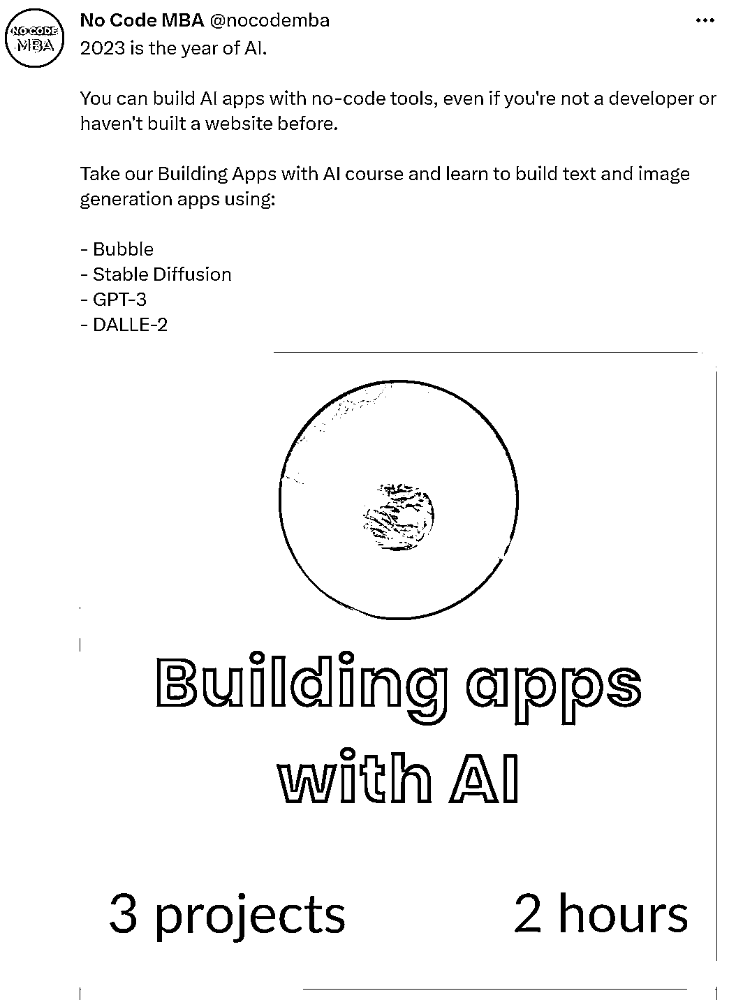
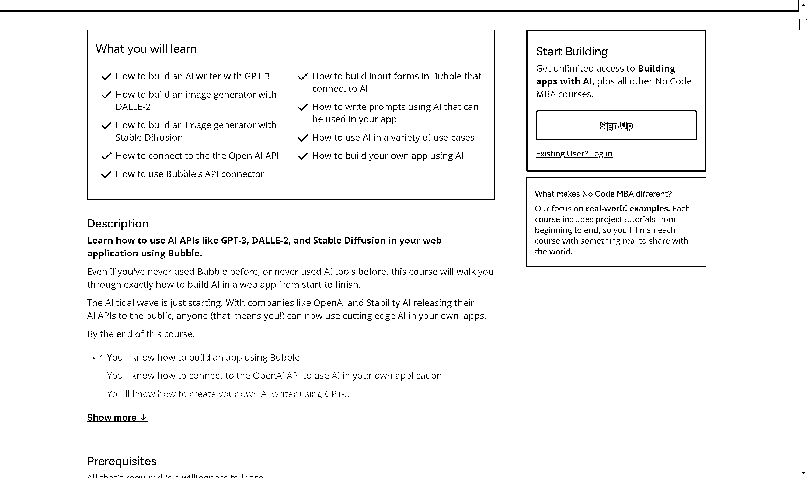

# 基于 AI 开发 APP，号称无需代码基础

> 原文：[`www.yuque.com/for_lazy/xkrm14/fgk72ac5z6idz2nc`](https://www.yuque.com/for_lazy/xkrm14/fgk72ac5z6idz2nc)

<ne-p id="u20f73d2d" data-lake-id="u20f73d2d"><ne-text id="u9d160837">作者： 张云金 _GISer</ne-text></ne-p> <ne-p id="ue28fce7a" data-lake-id="ue28fce7a"><ne-text id="u43c95607">日期：2023-01-28</ne-text></ne-p> <ne-p id="uaf33a254" data-lake-id="uaf33a254"><ne-text id="u8957e6d5">点赞数：</ne-text><ne-text id="u697aa641" ne-bold="true">11</ne-text></ne-p> <ne-hole id="u4a79dcfe" data-lake-id="u4a79dcfe"><ne-card data-card-name="hr" data-card-type="block" id="WNgEk" data-event-boundary="card"><ne-p id="u78b3cb92" data-lake-id="u78b3cb92"><ne-text id="u17a97ede">基于 ai 开发 APP，号称无需代码基础，晚上测试一下</ne-text> [<ne-text id="u6959039e">Building+apps+with+AI+-+Learning+Track</ne-text>](https://www.nocode.mba/tracks/building-apps-with-ai)</ne-p> <ne-p id="ue794a1e3" data-lake-id="ue794a1e3"><ne-card data-card-name="image" data-card-type="inline" id="bd0dk" data-event-boundary="card"></ne-card></ne-p> <ne-p id="ub07e41ae" data-lake-id="ub07e41ae"><ne-card data-card-name="image" data-card-type="inline" id="Fn3bI" data-event-boundary="card"></ne-card></ne-p> <ne-hole id="u14d6f512" data-lake-id="u14d6f512"><ne-card data-card-name="hr" data-card-type="block" id="hPTle" data-event-boundary="card"><ne-p id="u867370c6" data-lake-id="u867370c6"><ne-text id="u32e5be59">公众号懒人找资源，懒人专属群分享</ne-text></ne-p></ne-card></ne-hole></ne-card></ne-hole>