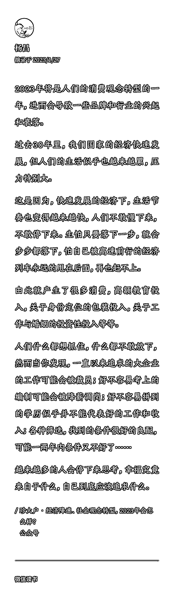
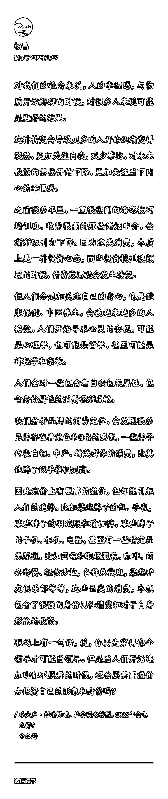

# 2023 年，可能将会是大家消费观念转型的一年，消费观念变了，需求就会变

> 原文：[`www.yuque.com/for_lazy/xkrm14/ihp2tw3x4gb0p9ls`](https://www.yuque.com/for_lazy/xkrm14/ihp2tw3x4gb0p9ls)

作者： 杨昌 

日期：2023-01-27 

点赞数：20 

珍大户说 2023 年，可能将会是大家消费观念转型的一年。 消费观念变了，需求就会变，举几个印象比较深刻的例子： 1、热门的婚恋技巧培训班吸引力将下降，健康保健、中医养生则会被越来越多的人接受 2、人们开始寻求心灵的安抚，可能是心理学，也可能是哲学，甚至可能是神秘学和宗教 3、目前市面上常见的婴幼儿游泳、婴幼儿早教、各种室内的培训，会渐渐变得难做了 4、文化产业的朋友，写网文拍电影，也不要再拍霸道总裁、富二代、职场精英了；拍点《杂货店的日常》，小旅馆的见闻八卦，一家网吧 20 年兴衰 

 

 

 

