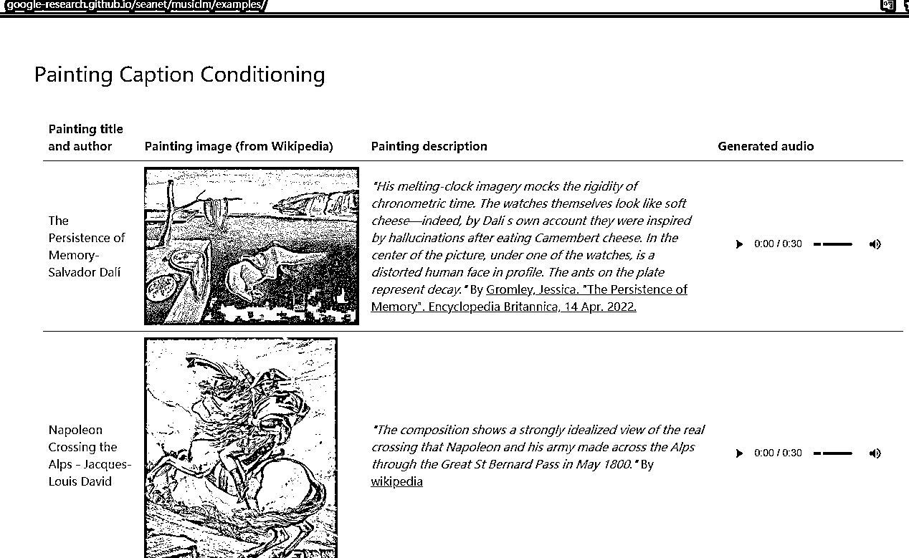

# AI 原创音乐，Google 发布了文本生成音乐的大模型 MusicLM

> 原文：[`www.yuque.com/for_lazy/xkrm14/bcbo3dg2m2x0d70y`](https://www.yuque.com/for_lazy/xkrm14/bcbo3dg2m2x0d70y)

作者： 财火 

日期：2023-01-27 

点赞数：28 

Google 发布了文本生成音乐的大模型 MusicLM 可以根据文字生成音乐，可以指定乐器、节奏、风格、播放场景。 也可以根据图片生成音乐，同样可以指定不同的风格与场景，非常强大。 继 AI 绘画之后，我们很快就能看到 AI 原创音乐了。 [MusicLM](https://google-research.github.io/seanet/musiclm/examples/) 

 

 

