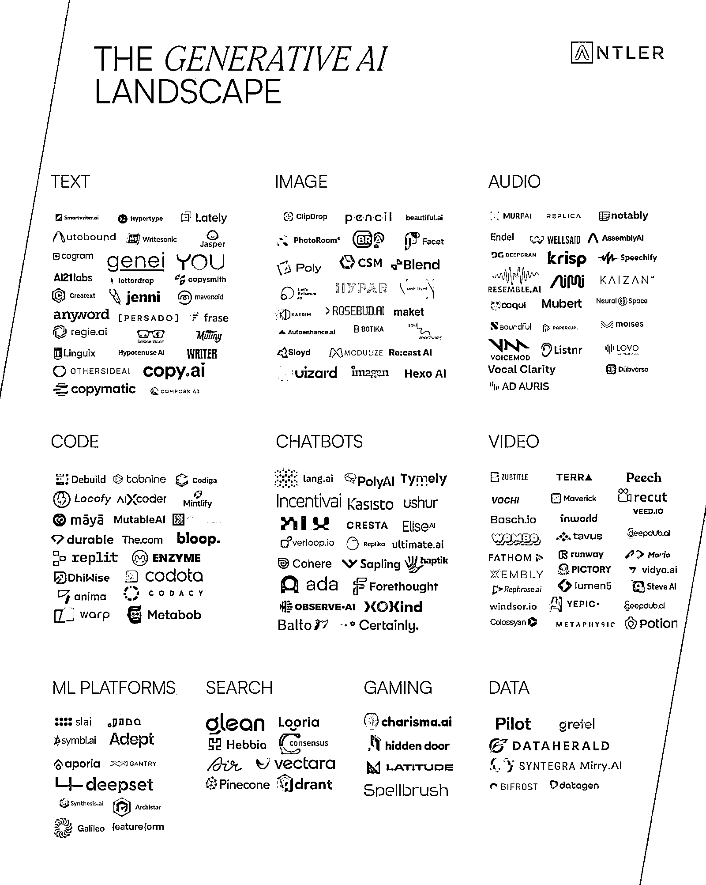

# 分享一个 AIGC 行业的玩家概览图，可直观了解 AIGC 具体的细分赛道

> 原文：[`www.yuque.com/for_lazy/xkrm14/ax3usgczxxo2zb5z`](https://www.yuque.com/for_lazy/xkrm14/ax3usgczxxo2zb5z)

作者： 麻木尔杜斯戈里亚 

日期：2023-01-23 

点赞数：25 

分享一个 AIGC 行业的玩家概览图，通过这张图，可以比较直观的了解 AIGC 具体有哪些细分赛道。通过拆解赛道里的公司，也可以快速搜集一些已经被别人找到的“用户需求”，以及对应这些需求的“解决方案”和“商业模式”。 因为眼下这波 AIGC 浪潮，底层技术支柱来源于海外的一些大模型（开源的，或者给 API 的），所以海外的相关创业公司“先行了一步”，这里面就存在一种“跟随式”的机会（类似 Quora 与知乎）。 

 

