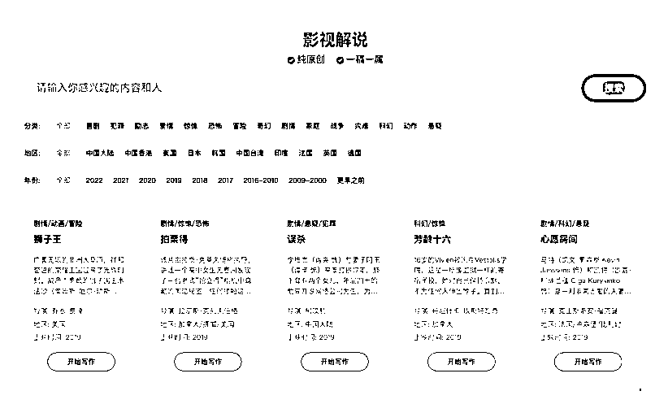

# 智搜 Giiso 写作机器人新功能 ，AI 一键生成「影视解说」

> 原文：[`www.yuque.com/for_lazy/xkrm14/rlqzagl7623fzwa0`](https://www.yuque.com/for_lazy/xkrm14/rlqzagl7623fzwa0)

<ne-p id="uc3ae1fee" data-lake-id="uc3ae1fee"><ne-text id="u9dd2269c">作者： 生财王子</ne-text></ne-p> <ne-p id="u0298ce6f" data-lake-id="u0298ce6f"><ne-text id="uc349aa6c">日期：2023-01-20</ne-text></ne-p> <ne-p id="u1e6253f2" data-lake-id="u1e6253f2"><ne-text id="u3a37c0a1">点赞数：</ne-text><ne-text id="ud0dc3d6e" ne-bold="true">57</ne-text></ne-p> <ne-hole id="u24b41198" data-lake-id="u24b41198"><ne-card data-card-name="hr" data-card-type="block" id="hLVm9" data-event-boundary="card"><ne-p id="u8d822b02" data-lake-id="u8d822b02"><ne-text id="u136ec0c9">智搜 Giiso 写作机器人新功能 AI 一键生成「影视解说」</ne-text> <ne-text id="u165e7293">这次推出的新功能，面向短视频领域里的影视解说。操作非常简单，筛选「电影名」，选择智能写作，即可一键生成影视解说脚本。</ne-text> <ne-text id="u6c134b26">除了原创这一核心价值外，「影视解说」支持一稿一属，即机器生成的每篇稿件仅提供给一位用户使用，再也不用担心重稿的尴尬了。</ne-text> <ne-text id="uede30210">怎么利用这个工具赚钱，就看大家的脑洞大开了~~[强]</ne-text></ne-p> <ne-p id="u6bc5f381" data-lake-id="u6bc5f381"><ne-card data-card-name="image" data-card-type="inline" id="nTnSJ" data-event-boundary="card"></ne-card></ne-p> <ne-hole id="u94345bec" data-lake-id="u94345bec"><ne-card data-card-name="hr" data-card-type="block" id="bqapc" data-event-boundary="card"><ne-p id="uf969b211" data-lake-id="uf969b211"><ne-text id="u7f98cd9d">公众号懒人找资源，懒人专属群分享</ne-text></ne-p></ne-card></ne-hole></ne-card></ne-hole>