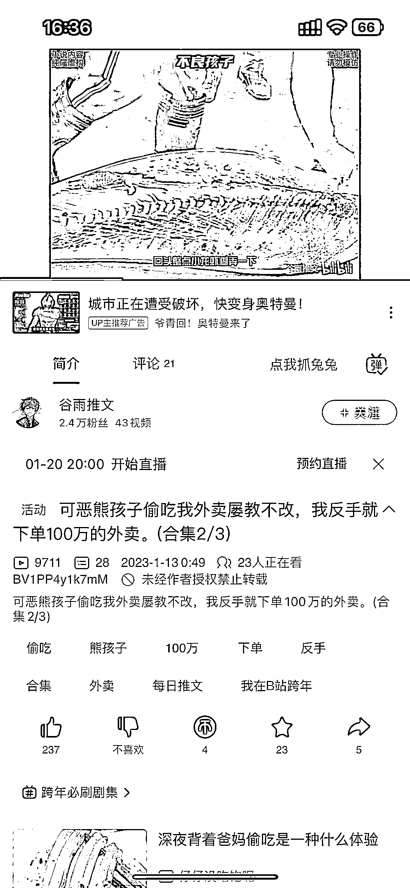

# AI 应用的例子：刷到 B 站小说视频，一个半月涨粉 2.4 万

> 原文：[`www.yuque.com/for_lazy/xkrm14/fuznfts0l2ogxgr6`](https://www.yuque.com/for_lazy/xkrm14/fuznfts0l2ogxgr6)

作者： 阿袁 

日期：2023-01-18 

点赞数：22 

刷到 B 站小说视频，一个半月涨粉 2.4 万，这不就是 AI 应用的例子喽！ 小说内容：用关键字然后''AI 人工智能生成 小说配音：人工智能合成 视频内容：不一定强相关，找无版权长视频，或几张''AI 绘图 注意故事最好分三段发，引流 账号起来后还可以挂橱窗 当然有精力也可以开直播，套用无人直播的套路。 这个 UP 主 12 月 5 号开始发的视频，到现在才一个半月就 2.4 万粉丝，其他平台也可以套用，抖音，快手，视频号，小红书，等等 

 

 

