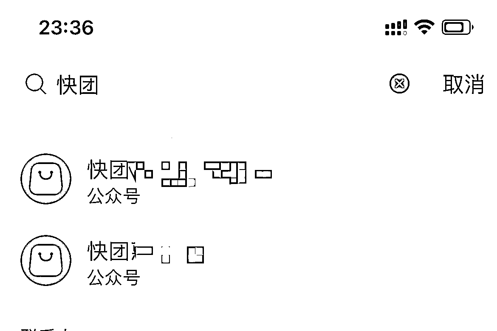

# 快团团快速转化方法：根据客户画像买一个符合条件的公众号，改名为快团 XXX，每周推送一条低价团购信息

> 原文：[`www.yuque.com/for_lazy/xkrm14/mqu9fwag03cypyhn`](https://www.yuque.com/for_lazy/xkrm14/mqu9fwag03cypyhn)

<ne-p id="ub3b256a8" data-lake-id="ub3b256a8"><ne-text id="uc2086105">作者： 韵韵</ne-text></ne-p> <ne-p id="u2362c96a" data-lake-id="u2362c96a"><ne-text id="u2e5cfae6">日期：2023-01-29</ne-text></ne-p> <ne-p id="u40ccae28" data-lake-id="u40ccae28"><ne-text id="u7812d023">点赞数：</ne-text><ne-text id="u3df17445" ne-bold="true">25</ne-text></ne-p> <ne-hole id="u24244d17" data-lake-id="u24244d17"><ne-card data-card-name="hr" data-card-type="block" id="zsdWx" data-event-boundary="card"><ne-p id="u1d0054e0" data-lake-id="u1d0054e0"><ne-text id="u876b9b84">快团团快速转化的一个方法： 根据客户画像，buy 一个符合条件的公众号（服务号），改名为快团 XXX，每周推送一条美妆低价团购信息。 1.可以吃搜索流量。</ne-text> <ne-text id="u47bff4c0">2.直接触达用户，点进去就是跟团信息，容易产生从众购买行为。 3.订阅团长后，以后每次开团，用户都会收到公号消息。</ne-text></ne-p> <ne-p id="u12aa6956" data-lake-id="u12aa6956"><ne-card data-card-name="image" data-card-type="inline" id="Mmszc" data-event-boundary="card"></ne-card></ne-p> <ne-p id="u91476195" data-lake-id="u91476195"><ne-card data-card-name="image" data-card-type="inline" id="nZeNl" data-event-boundary="card"></ne-card></ne-p> <ne-p id="uc139af21" data-lake-id="uc139af21"><ne-card data-card-name="image" data-card-type="inline" id="d3Esi" data-event-boundary="card"></ne-card></ne-p> <ne-p id="u45f99c86" data-lake-id="u45f99c86"><ne-card data-card-name="image" data-card-type="inline" id="KOULu" data-event-boundary="card"></ne-card></ne-p> <ne-hole id="u23d0a6ef" data-lake-id="u23d0a6ef"><ne-card data-card-name="hr" data-card-type="block" id="jA91i" data-event-boundary="card"><ne-p id="u49286f8d" data-lake-id="u49286f8d"><ne-text id="u4b7fb6f6">公众号懒人找资源，懒人专属群分享</ne-text></ne-p></ne-card></ne-hole></ne-card></ne-hole>