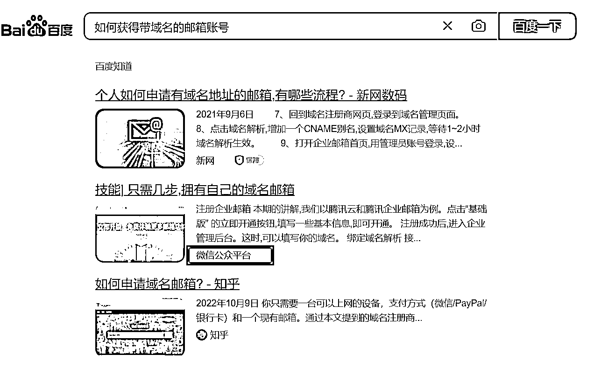

# 百度搜索结果开始出现微信公众号，是细分垂直行业 SEO 的福音

> 原文：[`www.yuque.com/for_lazy/xkrm14/eodezi1tzsrroq1g`](https://www.yuque.com/for_lazy/xkrm14/eodezi1tzsrroq1g)

<ne-p id="ucf77c19e" data-lake-id="ucf77c19e"><ne-text id="u3ca41534">作者： 许义</ne-text></ne-p> <ne-p id="ua719cfeb" data-lake-id="ua719cfeb"><ne-text id="ue51a2515">日期：2023-01-27</ne-text></ne-p> <ne-p id="ueb2a5fb4" data-lake-id="ueb2a5fb4"><ne-text id="u7058a19a">点赞数：</ne-text><ne-text id="ucca9c107" ne-bold="true">14</ne-text></ne-p> <ne-hole id="uebd648e3" data-lake-id="uebd648e3"><ne-card data-card-name="hr" data-card-type="block" id="Zj4O5" data-event-boundary="card"><ne-p id="u6d818f59" data-lake-id="u6d818f59"><ne-text id="ub527e701">百度搜索结果开始出现微信公众号， 目前有知乎，小红书，公众号平台都支持，我觉得是细分垂直行业 SEO 的福音。</ne-text></ne-p> <ne-p id="u7cc0ec27" data-lake-id="u7cc0ec27"><ne-card data-card-name="image" data-card-type="inline" id="nRufL" data-event-boundary="card"></ne-card></ne-p> <ne-hole id="u98dc5b65" data-lake-id="u98dc5b65"><ne-card data-card-name="hr" data-card-type="block" id="Sk4H7" data-event-boundary="card"><ne-p id="u9fe8a6f9" data-lake-id="u9fe8a6f9"><ne-text id="u9d126424">公众号懒人找资源，懒人专属群分享</ne-text></ne-p></ne-card></ne-hole></ne-card></ne-hole>