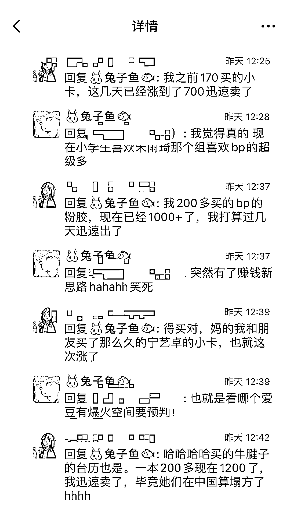

# 韩国爱豆小卡理财系列，转卖一张 300-1000+，对喜欢韩圈的更容易入手些

> 原文：[`www.yuque.com/for_lazy/xkrm14/fwqn9i6k44ihb7zg`](https://www.yuque.com/for_lazy/xkrm14/fwqn9i6k44ihb7zg)

作者： 🐰兔子鱼🐟 

日期：2023-01-26 

点赞数：9 

涨知识了也给大家分享系列🤨 “韩国爱豆小卡理财系列，转卖一张💰300-1000+” 之前经常看到有朋友在 pyq 分享小卡片说这次投资成功之类的话，直到朋友告诉我我才知道啥意思...还真的能赚钱😲 原价 130 涨到 400+，原价 192 涨到 700，听着让人怪心动的，于是我去问了一下普通人玩卡的可能性 朋友告诉我，不要只看到赚的，要提前预支钱买卡，要熟悉韩国爱豆圈，预判可能会火的爱豆，一旦某个大火，她曾经出过的小卡就有人想搜集，价格就上去了，但是剩下的卡（因为是随机抽卡）没火的可能就要低价出会亏不少钱 . 门槛还是比较高😂可能对喜欢韩圈的更容易入手些，权当一起给大家涨知识了～ 

 

 

 

 

 

