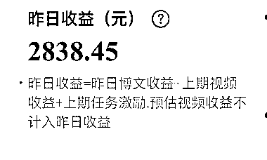
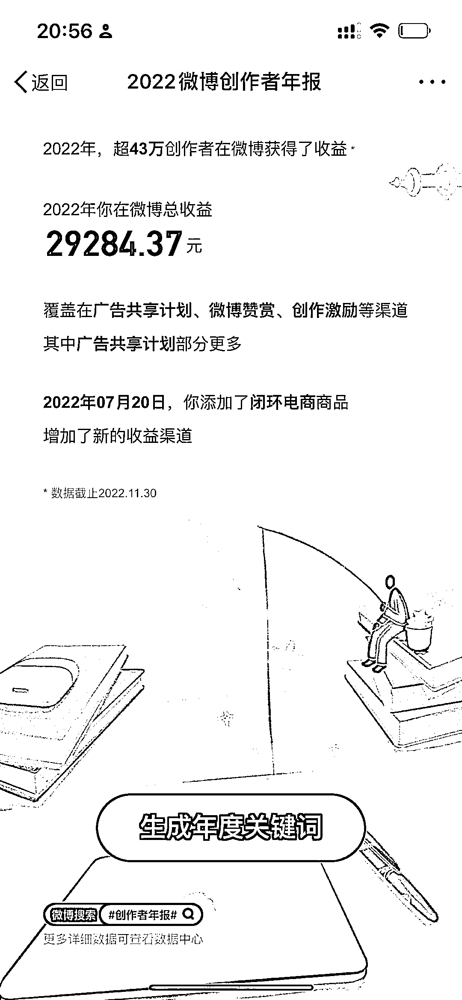
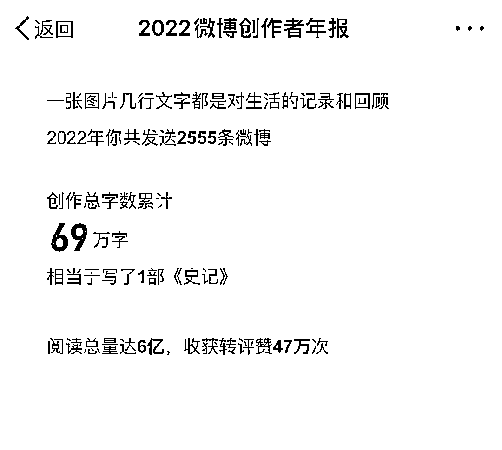

# 微博图文，写文娱热点，流量大，收益来源是站内广告分成

> 原文：[`www.yuque.com/for_lazy/xkrm14/ukg684xd5h9iml27`](https://www.yuque.com/for_lazy/xkrm14/ukg684xd5h9iml27)

作者： KWOK 

日期：2023-01-20 

点赞数：48 

相信生财不止有大牛，应该也有很多我这种零资源的小白。 分享一个零基础零资源在校学生党适合做的，也是我自己跑通的。 微博！ 我 2022 年 4 月份开始做微博，2022 年收益是 3W 不到，前期起号大概用了 3-4 个月，所以算下来后期坐起来每个月收益 5000 左右。我最高一次是一天收益 2K+ 主要收益来源是站内广告分成，我个人认为微博的优势是图文，区别于视频平台的优势是可以上班上学摸鱼做，有主业做副业最适合。 说一下我的实操方法，跟简单，就是写热点，最好是写文娱热点，流量大，坚持输出不水的长文，抄一些然后用软件去一下重，坚持每天更新 10 条左右，基本上第二个月流量就会很可观，认证一个金 V 文娱、互联网博主，把站内权重做起来。后期做起来就可以参加很多微博的扶持活动，收益和流量挂钩，前期收益不高但胜在稳定，所以我得意见就是建议没什么互联网经验的小白坚持做，挣个零花钱没问题，而且做起来很轻松，不卷。 后期有机会我再分享一些微博的敏感词规避，认证金 V，微博群组、怎么拿全部的广告收益分成等等。 我的微博是：大写的 KWOK，欢迎交流 

  

  

  

