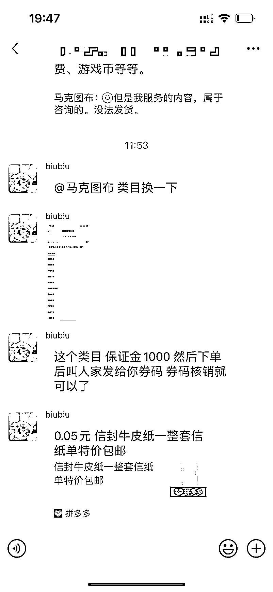

# 拼多多做虚拟蓝海要交 4 万押金，用这个方法 1000 块钱押金就可以做了

> 原文：[`www.yuque.com/for_lazy/xkrm14/bxang41cwb5msf3d`](https://www.yuque.com/for_lazy/xkrm14/bxang41cwb5msf3d)

<ne-p id="uf4a9eeac" data-lake-id="uf4a9eeac"><ne-text id="u242a4322">作者： 马克图布</ne-text></ne-p> <ne-p id="ub0d21caf" data-lake-id="ub0d21caf"><ne-text id="u1e0c4223">日期：2023-01-18</ne-text></ne-p> <ne-p id="u8404fc98" data-lake-id="u8404fc98"><ne-text id="ua65bfc08">点赞数：</ne-text><ne-text id="u62f46de2" ne-bold="true">56</ne-text></ne-p> <ne-hole id="u345d61e3" data-lake-id="u345d61e3"><ne-card data-card-name="hr" data-card-type="block" id="UzS5x" data-event-boundary="card"><ne-p id="u7e241764" data-lake-id="u7e241764"><ne-text id="ua912d1aa">拼多多做虚拟蓝海要交 4 万押金，用这个方法 1000 块钱押金就可以做了[呲牙] 最近在测试跑小红书到拼多多的链路转化。 垃圾拼多多客服，耽误了我 1</ne-text> <ne-text id="u701006fd">个上午。一直没有解决我问题。[捂脸] 只是单纯想弄一个无货源发货的链路，拼多多要 做无货源发货要交 4 万押金，简直是狗[旺柴]，吃那么难看。</ne-text> <ne-text id="u2ecb0fa8">其实有方法只要 1000 押金就行了。 问了做拼多多培训的小伙伴，不愿意透露这个方法。 在另一个群咨询了一下圈友，给了一个正向解决方案，虽然没太懂。</ne-text> <ne-text id="ua9787e41">然后淘宝去搜做培训的人的教程，看看有没有可能有，无意中发现别人无货源店铺里有拼多多虚拟发货的教程在卖。好家伙一块钱！</ne-text> <ne-text id="u2b343950">里面包含了如何自动发货，核销码解决。资料全有 真的是踏破铁鞋无觅处。柳暗花明又一村。 跟着教程还顺便设置好了发货核销，全自动发货了[红包][红包]</ne-text> <ne-text id="ueb30c5c4">收获满满，仿佛省下来 4 万块</ne-text></ne-p> <ne-p id="ucc777637" data-lake-id="ucc777637"><ne-card data-card-name="image" data-card-type="inline" id="h3zqd" data-event-boundary="card">  <ne-p id="u3f65c747" data-lake-id="u3f65c747"><ne-card data-card-name="image" data-card-type="inline" id="bnHwI" data-event-boundary="card">  <ne-p id="u45dc46c4" data-lake-id="u45dc46c4"><ne-card data-card-name="image" data-card-type="inline" id="B1V7M" data-event-boundary="card">  <ne-p id="u99e8b30f" data-lake-id="u99e8b30f"><ne-card data-card-name="image" data-card-type="inline" id="s2TIj" data-event-boundary="card"></ne-card></ne-p> <ne-hole id="u174897a7" data-lake-id="u174897a7"><ne-card data-card-name="hr" data-card-type="block" id="V8VpE" data-event-boundary="card"><ne-p id="uba5c6b76" data-lake-id="uba5c6b76"><ne-text id="u49035d57">公众号懒人找资源，懒人专属群分享</ne-text></ne-p></ne-card></ne-hole></ne-card></ne-p></ne-card></ne-p></ne-card></ne-p></ne-card></ne-hole>