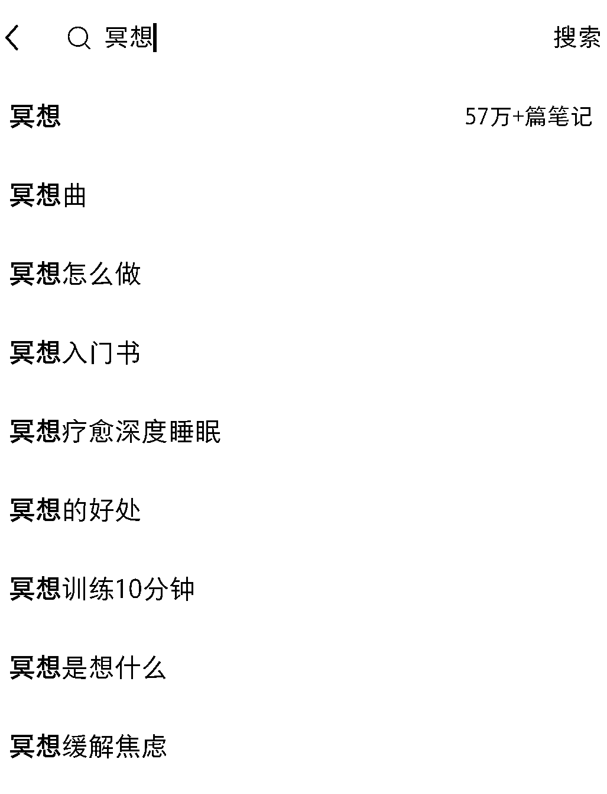

# 中国心理健康市场相比美国有 30 倍的增量空间，冥想博主正在成为一个新的细分垂直内容群体

> 原文：[`www.yuque.com/for_lazy/xkrm14/wli0itwpo2cdkz94`](https://www.yuque.com/for_lazy/xkrm14/wli0itwpo2cdkz94)

作者： 小玫瑰 

日期：2023-01-18 

点赞数：25 

月入百万，他们让冥想做成健康生意 疫情之后，全球精神障碍疾病负担更重，重度抑郁和焦虑分别增加了 28%和 26%，另外根据数据表明，目前我国每百万人口仅有 20 人能够提供心理健康服务，而美国是 1000 人，相差 50 倍之多。这意味着，中国心理健康市场有 30 倍的增量空间。 小红书上有近 60 万关于冥想的笔记，keep 运动每月有近 30 万人在站内搜冥想关键词。在社交媒体上，冥想博主正在成为一个新的细分垂直内容群体。 

  

