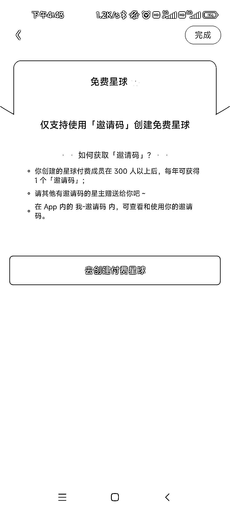

# 知识星球限制创建免费星球，需要使用邀请码才能创建免费星球

> 原文：[`www.yuque.com/for_lazy/xkrm14/uvgerdnion6u6u3g`](https://www.yuque.com/for_lazy/xkrm14/uvgerdnion6u6u3g)

<ne-p id="uf84e0499" data-lake-id="uf84e0499"><ne-text id="u814d5c22">作者： 程序员卡诺</ne-text></ne-p> <ne-p id="u731d0ea1" data-lake-id="u731d0ea1"><ne-text id="uc056313b">日期：2023-01-17</ne-text></ne-p> <ne-p id="u154d27c7" data-lake-id="u154d27c7"><ne-text id="u532c5f90">点赞数：</ne-text><ne-text id="u50aa1a74" ne-bold="true">23</ne-text></ne-p> <ne-hole id="u11fc1a04" data-lake-id="u11fc1a04"><ne-card data-card-name="hr" data-card-type="block" id="RmQuX" data-event-boundary="card"><ne-p id="uf547bb97" data-lake-id="uf547bb97"><ne-text id="u76749c99">知识星球限制创建免费星球啦 需要使用邀请码才能创建免费星球 300 人以上的付费星球，每年星球主能获得一个邀请码</ne-text></ne-p> <ne-p id="ud8669c62" data-lake-id="ud8669c62"><ne-card data-card-name="image" data-card-type="inline" id="HOIF9" data-event-boundary="card"></ne-card></ne-p> <ne-hole id="u3634e23e" data-lake-id="u3634e23e"><ne-card data-card-name="hr" data-card-type="block" id="xNdBM" data-event-boundary="card"><ne-p id="uca5d598c" data-lake-id="uca5d598c"><ne-text id="uc9c68c92">公众号懒人找资源，懒人专属群分享</ne-text></ne-p></ne-card></ne-hole></ne-card></ne-hole>