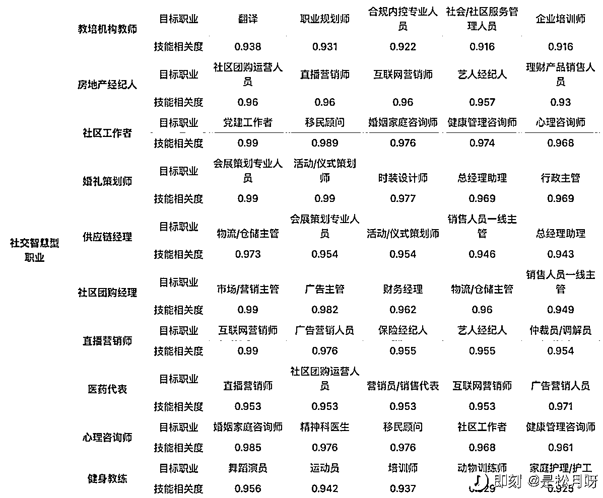
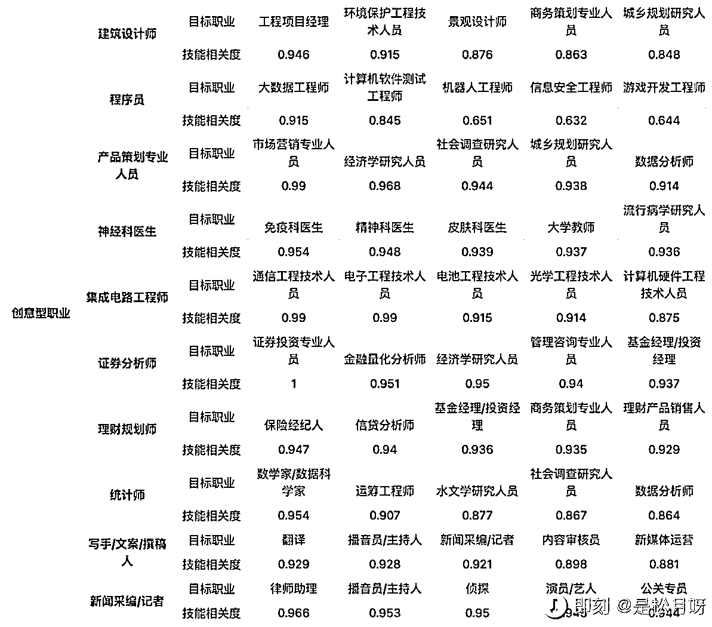
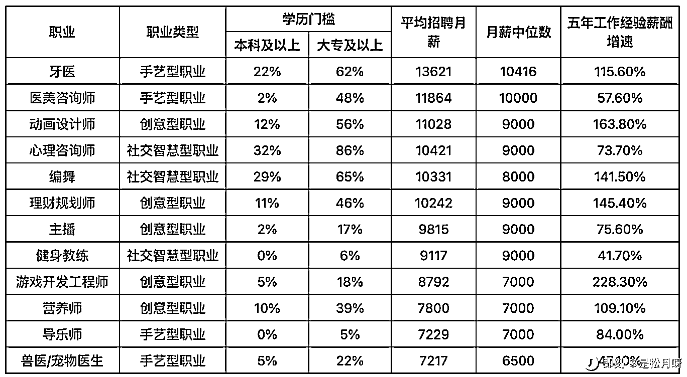
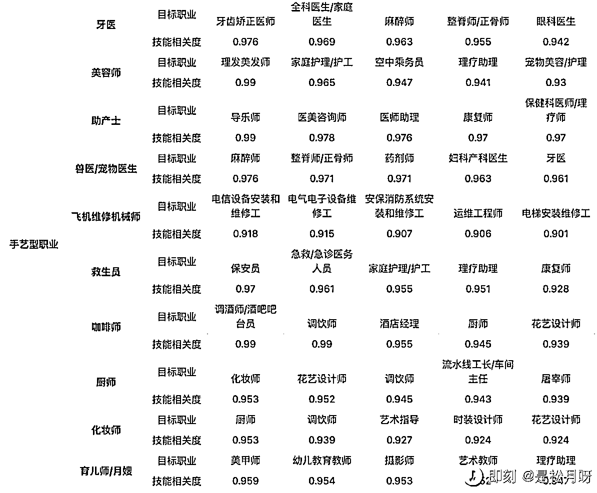

# 《2023 香帅财富报告》里面提到了几个转行转岗的趋势

> 原文：[`www.yuque.com/for_lazy/xkrm14/zpnk2p63zu4uwklp`](https://www.yuque.com/for_lazy/xkrm14/zpnk2p63zu4uwklp)

<ne-p id="u9fd1c185" data-lake-id="u9fd1c185"><ne-text id="u3a411f53">作者： 炮爷(以前叫樱木)</ne-text></ne-p> <ne-p id="ua273b912" data-lake-id="ua273b912"><ne-text id="u394cf20c">日期：2023-01-17</ne-text></ne-p> <ne-p id="u04564d39" data-lake-id="u04564d39"><ne-text id="u5eb50e48">点赞数：</ne-text><ne-text id="u5d09443b" ne-bold="true">19</ne-text></ne-p> <ne-hole id="uba9f3db8" data-lake-id="uba9f3db8"><ne-card data-card-name="hr" data-card-type="block" id="ZJct1" data-event-boundary="card"><ne-p id="u8967cdaf" data-lake-id="u8967cdaf"><ne-text id="u1e6b866f">如果想转行转岗，可迁移的赛道有哪些？ 《2023 香帅财富报告》里面提到了几个转行转岗的趋势，很受启发，也想和你分享。</ne-text> <ne-text id="uf2c35724">1、下一个十年，我们将迎来从有用性消费到有益性消费的趋势变化，从而带来新一批职业赛道，有益性消费趋势有哪些相关职业，如图 1</ne-text> <ne-text id="u04a20714">2、转岗转行的原则：迁移到技能相近但趋势向上的岗位，报告抽取了 30 个代表性职业的 5 个相关职业，相关度更高，代表两种职位各自所需的技能更接近，如图</ne-text> <ne-text id="u965ad6b0">2~4</ne-text></ne-p> <ne-p id="u9151eb80" data-lake-id="u9151eb80"><ne-card data-card-name="image" data-card-type="inline" id="N9O4a" data-event-boundary="card"></ne-card></ne-p> <ne-p id="u24b24a01" data-lake-id="u24b24a01"><ne-card data-card-name="image" data-card-type="inline" id="kn5RE" data-event-boundary="card"></ne-card></ne-p> <ne-p id="u601c797e" data-lake-id="u601c797e"><ne-card data-card-name="image" data-card-type="inline" id="UMfIq" data-event-boundary="card"></ne-card></ne-p> <ne-p id="u43348c30" data-lake-id="u43348c30"><ne-card data-card-name="image" data-card-type="inline" id="iAVef" data-event-boundary="card"></ne-card></ne-p> <ne-hole id="uf38b5d4a" data-lake-id="uf38b5d4a"><ne-card data-card-name="hr" data-card-type="block" id="cWhdi" data-event-boundary="card"><ne-p id="u22765d92" data-lake-id="u22765d92"><ne-text id="u20c804b7">公众号懒人找资源，懒人专属群分享</ne-text></ne-p></ne-card></ne-hole></ne-card></ne-hole>