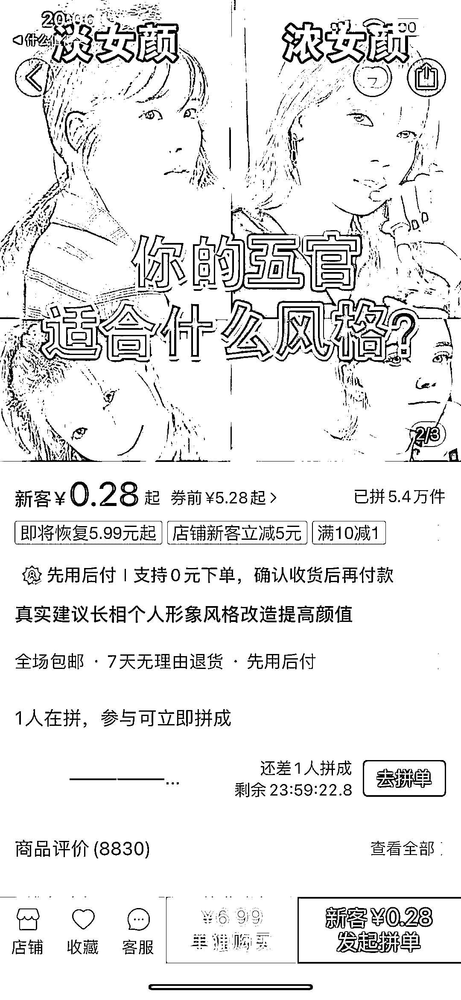
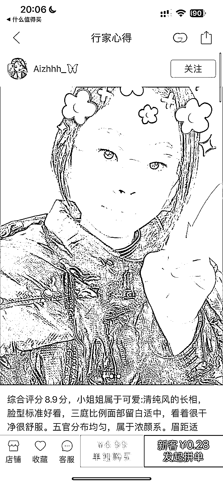
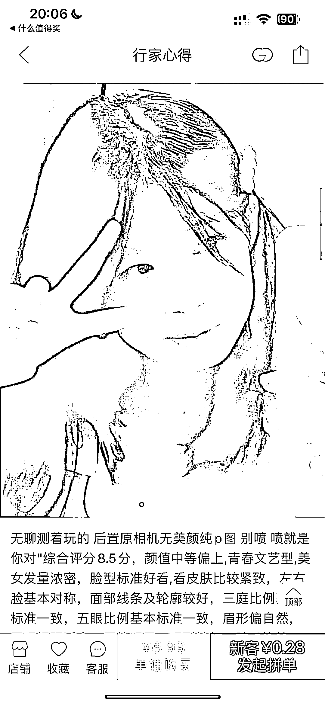

# 拼多多上，颜值打分都有 5.4 万份销售

> 原文：[`www.yuque.com/for_lazy/xkrm14/mxrv0zfqr8m3sng4`](https://www.yuque.com/for_lazy/xkrm14/mxrv0zfqr8m3sng4)

<ne-p id="u45f424f4" data-lake-id="u45f424f4"><ne-text id="u3fda228a">作者： 李厂长</ne-text></ne-p> <ne-p id="u09c07c79" data-lake-id="u09c07c79"><ne-text id="ud24ce34d">日期：2023-01-16</ne-text></ne-p> <ne-p id="u3b0563d7" data-lake-id="u3b0563d7"><ne-text id="u87a3a8ca">点赞数：</ne-text><ne-text id="uc4d6eb39" ne-bold="true">16</ne-text></ne-p> <ne-hole id="ub3c0f8ac" data-lake-id="ub3c0f8ac"><ne-card data-card-name="hr" data-card-type="block" id="Bfd6G" data-event-boundary="card"><ne-p id="ub3842058" data-lake-id="ub3842058"><ne-text id="uf65d9554">拼多多上，颜值打分都有 5.4 万份销售，太疯狂了</ne-text></ne-p> <ne-p id="ue930224a" data-lake-id="ue930224a"><ne-card data-card-name="image" data-card-type="inline" id="niUVz" data-event-boundary="card"></ne-card></ne-p> <ne-p id="u88f430db" data-lake-id="u88f430db"><ne-card data-card-name="image" data-card-type="inline" id="SZyOd" data-event-boundary="card"></ne-card></ne-p> <ne-p id="ua62345e8" data-lake-id="ua62345e8"><ne-card data-card-name="image" data-card-type="inline" id="lFd5O" data-event-boundary="card"></ne-card></ne-p> <ne-p id="u7b9084e1" data-lake-id="u7b9084e1"><ne-card data-card-name="image" data-card-type="inline" id="YaNst" data-event-boundary="card"></ne-card></ne-p> <ne-p id="u7bd73eb5" data-lake-id="u7bd73eb5"><ne-card data-card-name="image" data-card-type="inline" id="Ouu1C" data-event-boundary="card"></ne-card></ne-p> <ne-hole id="u1a100054" data-lake-id="u1a100054"><ne-card data-card-name="hr" data-card-type="block" id="NlKNv" data-event-boundary="card"><ne-p id="ua3685694" data-lake-id="ua3685694"><ne-text id="u726acb55">公众号懒人找资源，懒人专属群分享</ne-text></ne-p></ne-card></ne-hole></ne-card></ne-hole>