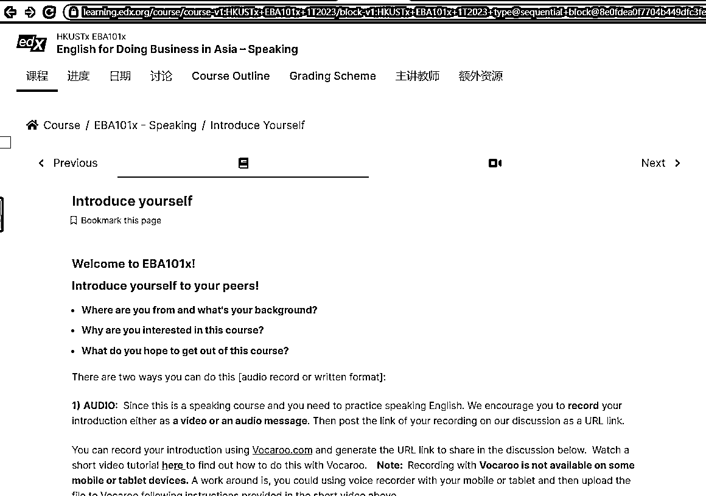

# edxonline 上几门很符合当今趋势的免费课程，能够增强综合能力和表现的普适性课程，非常有用

> 原文：[`www.yuque.com/for_lazy/xkrm14/wtam1sduig9epgo9`](https://www.yuque.com/for_lazy/xkrm14/wtam1sduig9epgo9)

作者： 财火 

日期：2023-01-27 

点赞数：24 

发现 edxonline 上几门很符合当今趋势的免费课程，这些课程都不是指定的专业领域如编程或设计，而是一些能够增强综合能力和表现的普适性课程，非常有用： 1、 哈佛大学的远程协作课程，教授如何使用好工具以及新的沟通模式来进行好团队的远程协作和交流 2、香港科技大学的商业英语写作课程，教授如何在职场使用好英语做商务材料 3、香港科技大学的商业英语会话课程，教授如何在职场使用好英语做商务沟通工作 4、伯克利的快乐科学，教授如何 hack 自己的生理和心理来生活及工作得更快乐 5、斯坦福大学的经济学原理，教授基本的经济学体系及对各行业、政府兴衰的分析 Remote+Work+Revolution+for+Everyone+|+edX work)English+for+Doing+Business+in+Asia+–+Writing+|+edX writing)English+for+Doing+Business+in+Asia+–+Speaking+|+ed... speaking)The+Science+of+Happiness+|+edX science-of-happiness-3)[Principles+of+Economics+|+edX](https://www.edx.org/course/principles-of-economics) 

  

