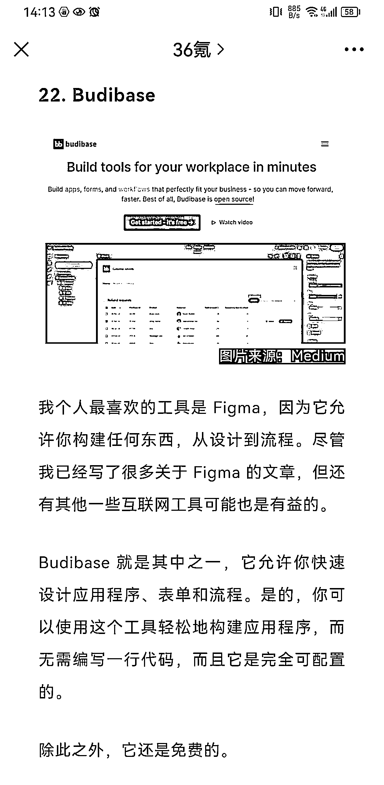

# 30+个杀手锏工具，帮助提高工作效率，里面的工具对程序员来说会更有帮助

> 原文：[`www.yuque.com/for_lazy/xkrm14/siiftg5ey1k8anz7`](https://www.yuque.com/for_lazy/xkrm14/siiftg5ey1k8anz7)

作者： 波本零 

日期：2023-01-27 

点赞数：28 

30+个杀手锏工具，帮助提高工作效率，其中里面的工具对程序员来说会更有帮助。 [2023 让你超越同龄人的 33 个杀手锏工具](https://mp.weixin.qq.com/s/RiPfxR_7pmzlIe-A2_sS-Q) 

 

 

 

