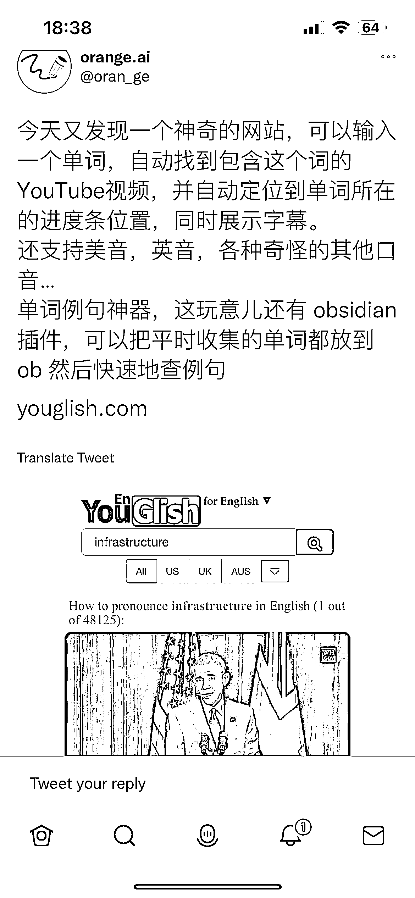

# 一个神奇的网站，输入一个单词，自动找到包含这个词的 YouTube 视频，并定位到单词所在的进度条位置

> 原文：[`www.yuque.com/for_lazy/xkrm14/lko83o2llv1iqezz`](https://www.yuque.com/for_lazy/xkrm14/lko83o2llv1iqezz)

作者： 蛤蟆先生 

日期：2023-01-26 

点赞数：14 

一个神奇的网站，可以输入一个单词，自动找到包含这个词的 YouTube 视频，并自动定位到单词所在的进度条位置，同时展示字幕。 还支持美音，英音，各种奇怪的其他口音… 单词例句神器，这玩意儿还有 obsidian 插件，可以把平时收集的单词都放到 ob 然后快速地查例句。 支持多语言和手语。 

 

