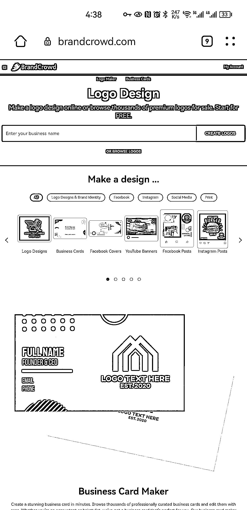

# 推荐一个 logo 设计网站

> 原文：[`www.yuque.com/for_lazy/xkrm14/ouum5q6unw79uagr`](https://www.yuque.com/for_lazy/xkrm14/ouum5q6unw79uagr)

<ne-p id="u8f05f343" data-lake-id="u8f05f343"><ne-text id="u7398e664">作者： Aimmon</ne-text></ne-p> <ne-p id="u0f6089a0" data-lake-id="u0f6089a0"><ne-text id="uce30cce0">日期：2023-01-17</ne-text></ne-p> <ne-p id="u30e20344" data-lake-id="u30e20344"><ne-text id="uae6e0add">点赞数：</ne-text><ne-text id="u957afd26" ne-bold="true">25</ne-text></ne-p> <ne-hole id="u8971d911" data-lake-id="u8971d911"><ne-card data-card-name="hr" data-card-type="block" id="REGWd" data-event-boundary="card"><ne-p id="u648110a3" data-lake-id="u648110a3"><ne-text id="ue02b5cb1">推荐一个 logo 设计网站，用过 logosc，阿里云智能 logo，但就创意而言，感觉还是这个 brandcrowd 更好看 网址</ne-text> <ne-text id="udd4ef538">brandcrowd@com（@换成.）</ne-text></ne-p> <ne-p id="u086fecc3" data-lake-id="u086fecc3"><ne-card data-card-name="image" data-card-type="inline" id="djyOS" data-event-boundary="card"></ne-card></ne-p> <ne-p id="ub2c5d3e8" data-lake-id="ub2c5d3e8"><ne-card data-card-name="image" data-card-type="inline" id="pALBd" data-event-boundary="card"></ne-card></ne-p> <ne-p id="u85fe5892" data-lake-id="u85fe5892"><ne-card data-card-name="image" data-card-type="inline" id="DBiLh" data-event-boundary="card"></ne-card></ne-p> <ne-hole id="uaa7fdfdf" data-lake-id="uaa7fdfdf"><ne-card data-card-name="hr" data-card-type="block" id="ccR69" data-event-boundary="card"><ne-p id="u0acb114b" data-lake-id="u0acb114b"><ne-text id="u81455b99">公众号懒人找资源，懒人专属群分享</ne-text></ne-p></ne-card></ne-hole></ne-card></ne-hole>