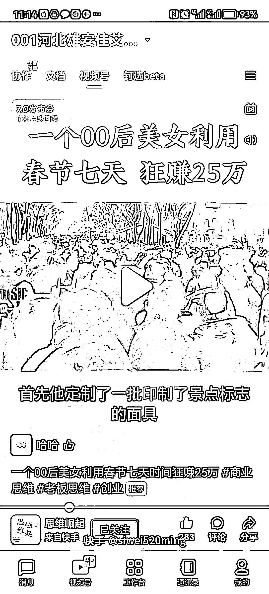

# 分享一个春节期间，狂赚 25 万的可行案例

> 原文：[`www.yuque.com/for_lazy/xkrm14/tuelhqhzligrpryw`](https://www.yuque.com/for_lazy/xkrm14/tuelhqhzligrpryw)

<ne-p id="u24328eca" data-lake-id="u24328eca"><ne-text id="u0900e919">作者： lyf</ne-text></ne-p> <ne-p id="uf375622e" data-lake-id="uf375622e"><ne-text id="u5a5dbfb1">日期：2023-01-29</ne-text></ne-p> <ne-p id="u678c8b7f" data-lake-id="u678c8b7f"><ne-text id="u61fb7c24">点赞数：</ne-text><ne-text id="ub2697dac" ne-bold="true">60</ne-text></ne-p> <ne-hole id="uc91b8686" data-lake-id="uc91b8686"><ne-card data-card-name="hr" data-card-type="block" id="krojS" data-event-boundary="card"><ne-p id="u411302c9" data-lake-id="u411302c9"><ne-text id="ucf5b54f6">分享一个春节期间，狂赚 25 万的可行案例。看完视频，整体流程整理如下： 1.定制了 10 万个有景区标识的面具，搞了一个面具节。</ne-text> <ne-text id="u8dbf612e">2.雇人免费发放给游客。游客需要交 5 元押金，同时扫码关注公众号，才能领取。成本在 2-3 元一个。 3.由于基本都是全家出游，🈶小孩的很喜欢。</ne-text> <ne-text id="uce3fbb50">4.虽然可以退回，但实际的退押金比例也就在 10%左右。扣除成本，净利润在 25 万左右。 这里有几个因素，导致退回率低：</ne-text> <ne-text id="u3d48b4c2">1.小孩喜欢，退回来，小孩子可能不高兴，父母一般不退。 2.押金很少，退回还需要排队，很多父母嫌麻烦，就不退了。 玩法可以推广到其他景区，其他产品</ne-text></ne-p> <ne-p id="ueee62bcb" data-lake-id="ueee62bcb"><ne-card data-card-name="image" data-card-type="inline" id="mGgBm" data-event-boundary="card"></ne-card></ne-p> <ne-hole id="ubde76366" data-lake-id="ubde76366"><ne-card data-card-name="hr" data-card-type="block" id="pDks2" data-event-boundary="card"><ne-p id="u90e2611e" data-lake-id="u90e2611e"><ne-text id="u1443f2c4">公众号懒人找资源，懒人专属群分享</ne-text></ne-p></ne-card></ne-hole></ne-card></ne-hole>