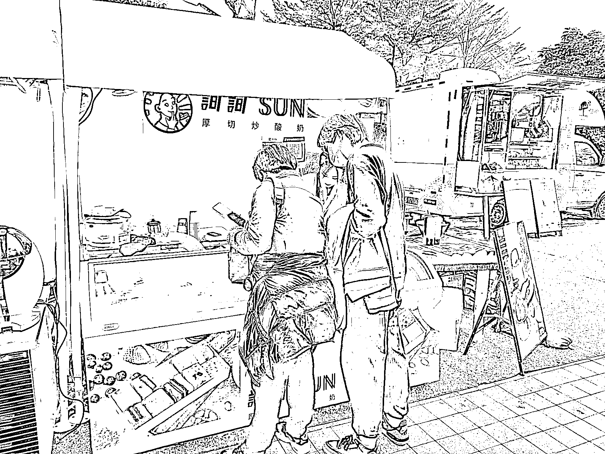
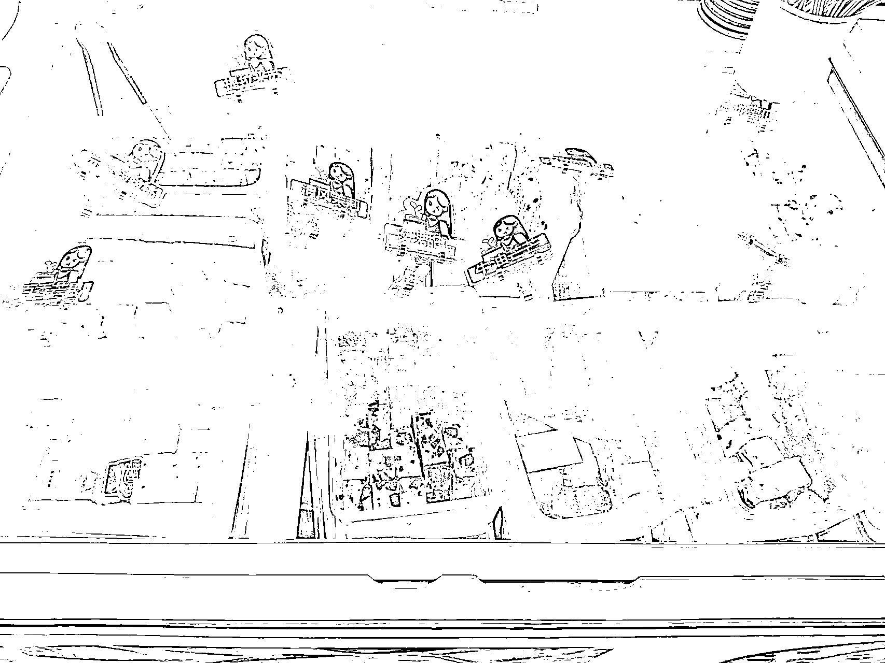

# 发一个线下生意，“厚切酸奶”，售价 30 元 6 块，成本大约 10 元 36 块

> 原文：[`www.yuque.com/for_lazy/xkrm14/zkl0xht904yfdt2v`](https://www.yuque.com/for_lazy/xkrm14/zkl0xht904yfdt2v)

作者： 田新一 

日期：2023-01-29 

点赞数：29 

发一个线下生意，春节旅行时发现了一个挺好的摆摊品类，叫做“厚切酸奶”，售价 30 元 6 块。在抖音上看了下制作方法，并不难，成本大约 10 元 36 块，6 块的成本不到 2 元。随着天气转暖，旅游升温，找个景点或者露营地售卖，日赚 1000 应该不难。 

 

 

