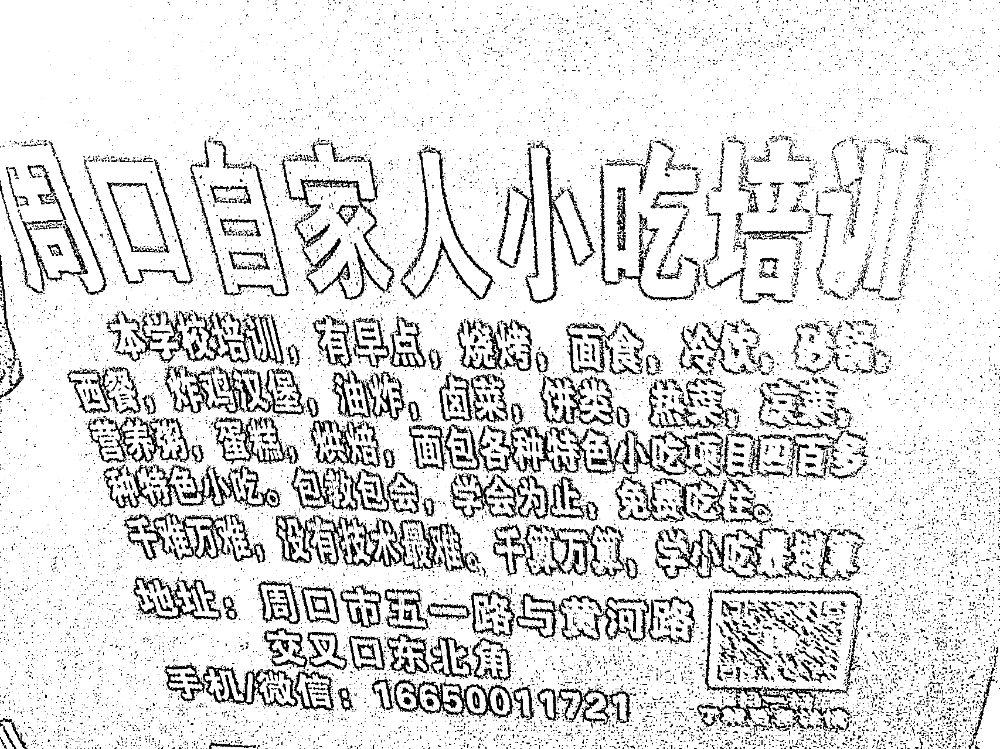

# 县城公交车座椅的背后放置的二维码，扫描后是一个“合集类”的小吃培训

> 原文：[`www.yuque.com/for_lazy/xkrm14/yqy6a4fu61zfblg8`](https://www.yuque.com/for_lazy/xkrm14/yqy6a4fu61zfblg8)

作者： 常常 

日期：2023-01-18 

点赞数：21 

县城公交车座椅的背后放置的二维码，扫描后是一个“合集类”的小吃培训。 赚钱的机会，总是在眼皮子底下，你想不到一个合集类的小吃培训会有多赚钱。 参考小红书上的美食博主，收集一些美食教程，自己也可以制作这种“小吃合集”培训。 

 

 

