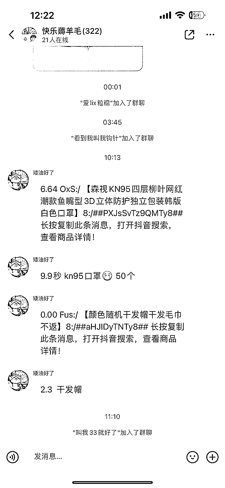

# 年底微信做淘宝客，微商等容易被封群封微信小红书群成为另类主战场

> 原文：[`www.yuque.com/for_lazy/xkrm14/dkq5em96g0iayr1u`](https://www.yuque.com/for_lazy/xkrm14/dkq5em96g0iayr1u)

作者： 斑马森林 

日期：2023-01-10 

点赞数：11 

年底微信做淘宝客，微商等容易被封群封微信小红书群成为另类主战场，小红书相比微信的特点： 1.小红书账号注册成本低 2.养号容易 3.引流的用户人群精准 4.直接用小红书群聊承接流量，省去引流微信二次转化的流失 5.微信群容易被举报封群封号的风险，小红书群聊风控不严格 6.笔记直接用类似薅羊毛相关的关键词批量生产 

  

