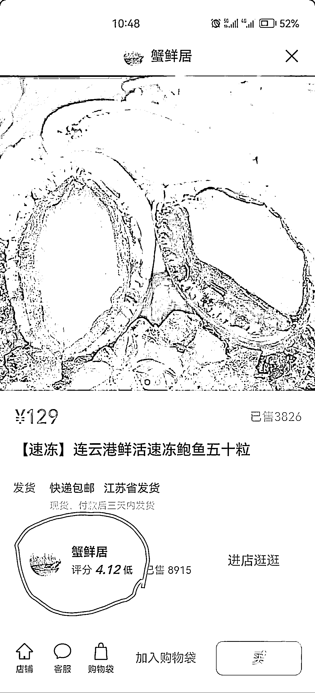

# 视频号小店上线了店铺评分体系，会激发一门生意，专门做店铺评分的业务

> 原文：[`www.yuque.com/for_lazy/xkrm14/ab02r46zl9gdh941`](https://www.yuque.com/for_lazy/xkrm14/ab02r46zl9gdh941)

<ne-p id="uc5bacc36" data-lake-id="uc5bacc36"><ne-text id="u9d6ab417">作者： 宏</ne-text></ne-p> <ne-p id="u31f388e7" data-lake-id="u31f388e7"><ne-text id="u9a0b2ea6">日期：2023-01-09</ne-text></ne-p> <ne-p id="u6d5d435b" data-lake-id="u6d5d435b"><ne-text id="uc303c0e1">点赞数：</ne-text><ne-text id="ufd02dd8a" ne-bold="true">14</ne-text></ne-p> <ne-hole id="u0451d3b0" data-lake-id="u0451d3b0"><ne-card data-card-name="hr" data-card-type="block" id="BYG24" data-event-boundary="card"><ne-p id="u3ed8b446" data-lake-id="u3ed8b446"><ne-text id="u46cafc44">视频号小店上线了店铺评分体系，看了几家，评分 4.5 以上算是高，以下算是低…从抖音的运行来看，这又会激发一门生意，专门做店铺评分的业务</ne-text></ne-p> <ne-p id="ue4935abb" data-lake-id="ue4935abb"><ne-card data-card-name="image" data-card-type="inline" id="geTwP" data-event-boundary="card"></ne-card></ne-p> <ne-p id="uec74a746" data-lake-id="uec74a746"><ne-card data-card-name="image" data-card-type="inline" id="LXeHY" data-event-boundary="card">  <ne-p id="u8df963e3" data-lake-id="u8df963e3"><ne-card data-card-name="image" data-card-type="inline" id="qg7pY" data-event-boundary="card"></ne-card></ne-p> <ne-p id="uad9e47b1" data-lake-id="uad9e47b1"><ne-card data-card-name="image" data-card-type="inline" id="tnXEs" data-event-boundary="card"></ne-card></ne-p> <ne-hole id="ud6170487" data-lake-id="ud6170487"><ne-card data-card-name="hr" data-card-type="block" id="iVt36" data-event-boundary="card"><ne-p id="ufdfbaa55" data-lake-id="ufdfbaa55"><ne-text id="u588334ff">公众号懒人找资源，懒人专属群分享</ne-text></ne-p></ne-card></ne-hole></ne-card></ne-p></ne-card></ne-hole>