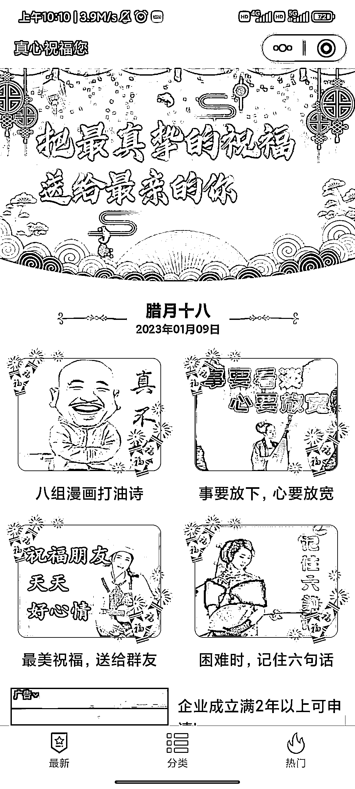
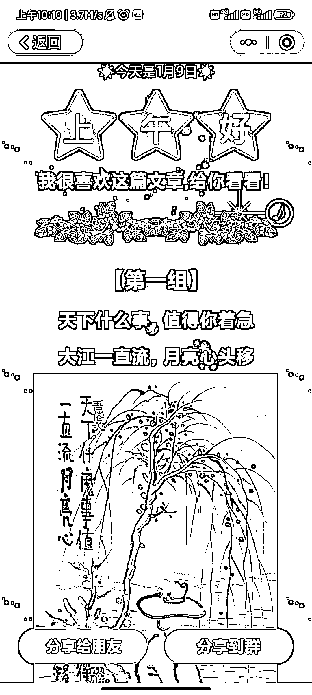
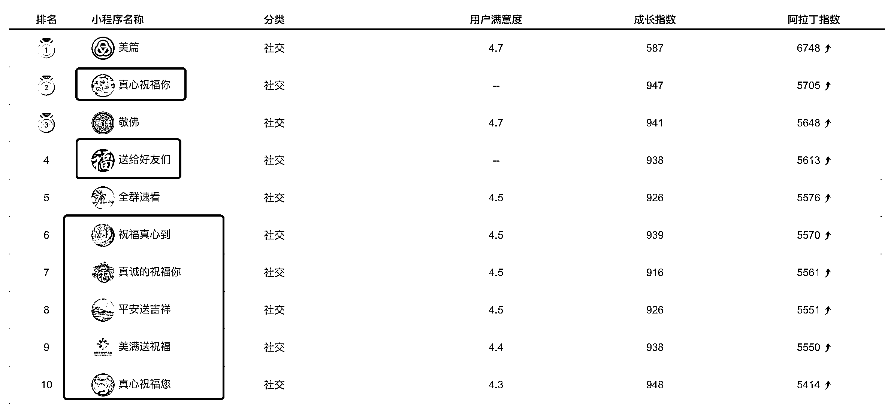

# 阿拉丁小程序排行榜日榜，社交领域内排行靠前的前 10 个小程序里，有 7、8 个都是关于祝福的小程序

> 原文：[`www.yuque.com/for_lazy/xkrm14/emcfays8n3rlacr3`](https://www.yuque.com/for_lazy/xkrm14/emcfays8n3rlacr3)

<ne-p id="u741f7759" data-lake-id="u741f7759"><ne-text id="u8dfe45b4">作者： 重楼</ne-text></ne-p> <ne-p id="u3240df28" data-lake-id="u3240df28"><ne-text id="uec10b5f2">日期：2023-01-09</ne-text></ne-p> <ne-p id="ueec3a787" data-lake-id="ueec3a787"><ne-text id="uf6a43c6b">点赞数：</ne-text><ne-text id="u5b7391ef" ne-bold="true">8</ne-text></ne-p> <ne-hole id="u26d6dcae" data-lake-id="u26d6dcae"><ne-card data-card-name="hr" data-card-type="block" id="jvhGX" data-event-boundary="card"><ne-p id="u63e53547" data-lake-id="u63e53547"><ne-text id="ua3da0f2f">阿拉丁小程序排行榜日榜，没想到社交领域内排行靠前的前 10 个小程序里，有 7、8 个都是关于祝福的小程序。临近过年，这一类的祝福小程序肯定也会迎来一次大爆发。现在看这个行业还处于早期的草莽时代，百家纷争，还没有真正形成壁垒的好产品出来，各位产品、流量爱好者可以研究一波了，产品形式也非常简单。</ne-text></ne-p> <ne-p id="uc03c60d1" data-lake-id="uc03c60d1"><ne-card data-card-name="image" data-card-type="inline" id="l02Dm" data-event-boundary="card"></ne-card></ne-p> <ne-p id="u1f95f829" data-lake-id="u1f95f829"><ne-card data-card-name="image" data-card-type="inline" id="mZGaD" data-event-boundary="card"></ne-card></ne-p> <ne-p id="u97ddec63" data-lake-id="u97ddec63"><ne-card data-card-name="image" data-card-type="inline" id="yl1Xp" data-event-boundary="card"></ne-card></ne-p> <ne-p id="uadf101f6" data-lake-id="uadf101f6"><ne-card data-card-name="image" data-card-type="inline" id="fYyQi" data-event-boundary="card"></ne-card></ne-p> <ne-hole id="u840298c0" data-lake-id="u840298c0"><ne-card data-card-name="hr" data-card-type="block" id="v4qX2" data-event-boundary="card"><ne-p id="u4b353831" data-lake-id="u4b353831"><ne-text id="ua6527d8b">公众号懒人找资源，懒人专属群分享</ne-text></ne-p></ne-card></ne-hole></ne-card></ne-hole>