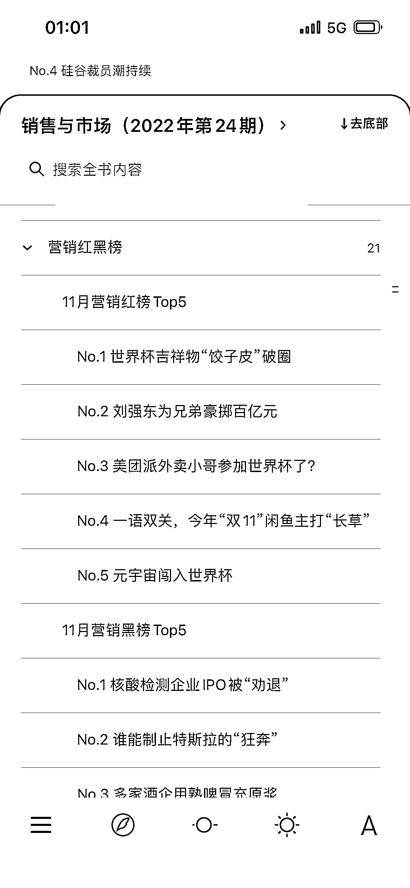
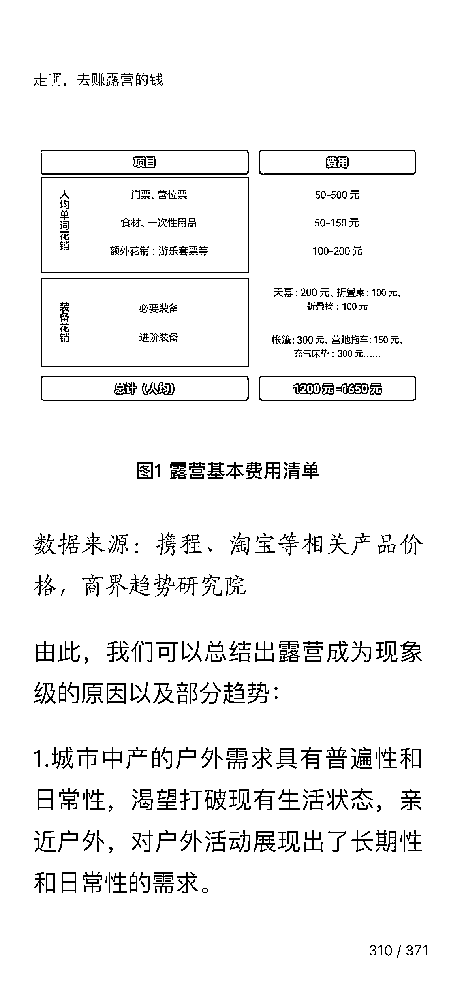

# 月刊型的商业杂志也是一个优质的信源，对趋势的预估会有更权威的分析，从中抓取到一些时效性的风向

> 原文：[`www.yuque.com/for_lazy/xkrm14/ngq2l9z7yiv0fm2a`](https://www.yuque.com/for_lazy/xkrm14/ngq2l9z7yiv0fm2a)

<ne-p id="u76e10113" data-lake-id="u76e10113"><ne-text id="u0f6f9400">作者： Jane</ne-text></ne-p> <ne-p id="u1699d34e" data-lake-id="u1699d34e"><ne-text id="u0d86c8f4">日期：2023-01-11</ne-text></ne-p> <ne-p id="uc4b1cc49" data-lake-id="uc4b1cc49"><ne-text id="u55e259c9">点赞数：</ne-text><ne-text id="u6b0404e9" ne-bold="true">18</ne-text></ne-p> <ne-hole id="uc0744339" data-lake-id="uc0744339"><ne-card data-card-name="hr" data-card-type="block" id="vdwVF" data-event-boundary="card"><ne-p id="u8ac58f08" data-lake-id="u8ac58f08"><ne-text id="u2bf5b533">通过观察，发现很多圈友都是习惯从公众号，主流 APP 上面获取商机，一些月刊型的商业杂志也是一个优质的信源，对趋势的预估会有更权威的分析，也能从中抓取到一些时效性的风向。</ne-text></ne-p> <ne-p id="u89b16ccd" data-lake-id="u89b16ccd"><ne-card data-card-name="image" data-card-type="inline" id="xgABn" data-event-boundary="card"></ne-card></ne-p> <ne-p id="u6d64d37e" data-lake-id="u6d64d37e"><ne-card data-card-name="image" data-card-type="inline" id="aPTfc" data-event-boundary="card"></ne-card></ne-p> <ne-p id="ua6c098a5" data-lake-id="ua6c098a5"><ne-card data-card-name="image" data-card-type="inline" id="YwM1e" data-event-boundary="card"></ne-card></ne-p> <ne-p id="u2aadb609" data-lake-id="u2aadb609"><ne-card data-card-name="image" data-card-type="inline" id="P8jNU" data-event-boundary="card"></ne-card></ne-p> <ne-p id="uabf7083c" data-lake-id="uabf7083c"><ne-card data-card-name="image" data-card-type="inline" id="VuZJ4" data-event-boundary="card"></ne-card></ne-p> <ne-hole id="ufeea5542" data-lake-id="ufeea5542"><ne-card data-card-name="hr" data-card-type="block" id="wpm5D" data-event-boundary="card"><ne-p id="u83a50027" data-lake-id="u83a50027"><ne-text id="ucbc7935f">公众号懒人找资源，懒人专属群分享</ne-text></ne-p></ne-card></ne-hole></ne-card></ne-hole>