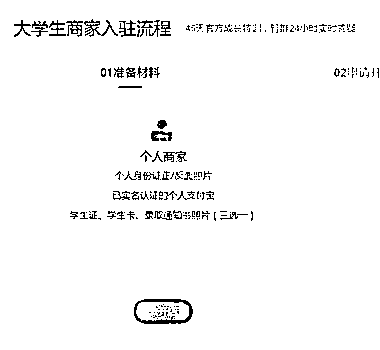

# 淘宝开店入驻，现在有专门针对大学生的入口，整合资源为在校生开淘宝店提供培训、货源等

> 原文：[`www.yuque.com/for_lazy/xkrm14/gm0iy3kdxn655ygf`](https://www.yuque.com/for_lazy/xkrm14/gm0iy3kdxn655ygf)

作者： 少儿探索科学实验室 

日期：2023-01-10 

点赞数：16 

历史新高！2023 高校毕业生达到 1158 万人，恐成最难毕业季，前几天看到淘宝的开店入驻，现在有专门针对大学生的入口，应该是有相关政策扶持的，所以，生财可以充分发挥圈子的优势，资源，组成一个小团队，专门做一件有意义的事情：赋能圈子里的大学毕业生，在校生创业开淘宝店，从技能，资源，货源，全方面赋能，还可以整合有货源的圈友，提供货源，多一个渠道 

 

 

