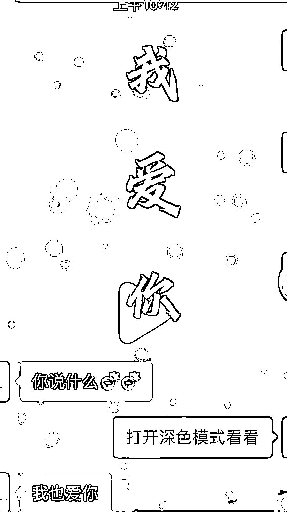

# 抖音刷到很多深色模式表白表情包，在视频号和小红书盘盘，链接到公众号做引流

> 原文：[`www.yuque.com/for_lazy/xkrm14/nea720saio7bvwyn`](https://www.yuque.com/for_lazy/xkrm14/nea720saio7bvwyn)

<ne-p id="uc9e87e4d" data-lake-id="uc9e87e4d"><ne-text id="u62d55828">作者： 小蒙</ne-text></ne-p> <ne-p id="u7f86c81f" data-lake-id="u7f86c81f"><ne-text id="ua4fa9254">日期：2023-01-13</ne-text></ne-p> <ne-p id="u64713ffa" data-lake-id="u64713ffa"><ne-text id="u1b7f0043">点赞数：</ne-text><ne-text id="u3d742f0f" ne-bold="true">37</ne-text></ne-p> <ne-hole id="u66dc2633" data-lake-id="u66dc2633"><ne-card data-card-name="hr" data-card-type="block" id="RgfCB" data-event-boundary="card"><ne-p id="u9695a96e" data-lake-id="u9695a96e"><ne-text id="ua7005fa0">抖音刷到很多深色模式表白表情包，感兴趣的伙伴可以研究下，在视频号和小红书盘盘，链接到公众号做引流</ne-text></ne-p> <ne-p id="u46b1b76f" data-lake-id="u46b1b76f"><ne-card data-card-name="image" data-card-type="inline" id="dX0Xg" data-event-boundary="card"></ne-card></ne-p> <ne-p id="u980cbf01" data-lake-id="u980cbf01"><ne-card data-card-name="image" data-card-type="inline" id="sh7sx" data-event-boundary="card"></ne-card></ne-p> <ne-hole id="uf0329250" data-lake-id="uf0329250"><ne-card data-card-name="hr" data-card-type="block" id="Lwjnd" data-event-boundary="card"><ne-p id="u16fa89c5" data-lake-id="u16fa89c5"><ne-text id="u2d8a3f98">公众号懒人找资源，懒人专属群分享</ne-text></ne-p></ne-card></ne-hole></ne-card></ne-hole>