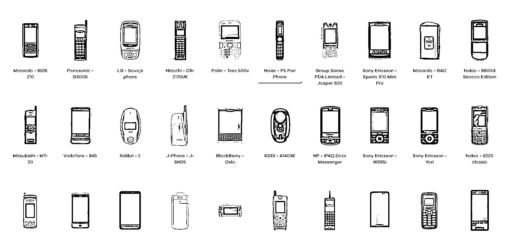

# 手机博物馆网站，应用到抖音做图集、视频，每天分享关于老式手机，嵌入问句

> 原文：[`www.yuque.com/for_lazy/xkrm14/nx5nb9m56rd6oc0g`](https://www.yuque.com/for_lazy/xkrm14/nx5nb9m56rd6oc0g)

<ne-p id="u9d01fc63" data-lake-id="u9d01fc63"><ne-text id="u60fe69b3">作者： 俊</ne-text></ne-p> <ne-p id="u647ff5d8" data-lake-id="u647ff5d8"><ne-text id="ue2c5d222">日期：2023-01-11</ne-text></ne-p> <ne-p id="ud4df9ca8" data-lake-id="ud4df9ca8"><ne-text id="uf6f68189">点赞数：</ne-text><ne-text id="u32305a27" ne-bold="true">25</ne-text></ne-p> <ne-hole id="uede279da" data-lake-id="uede279da"><ne-card data-card-name="hr" data-card-type="block" id="Eu7Yz" data-event-boundary="card"><ne-p id="u0304364d" data-lake-id="u0304364d"><ne-text id="ue18e7584">手机博物馆 -此网站收集了 2400 多款不同型号的老式手机，并且还有详细介绍以及当时的宣传片</ne-text> <ne-text id="u781bb4c2">应用到抖音上去，可以做图集，视频，每天分享关于老式手机，嵌入问句，可能会引起一波讨论。</ne-text>[<ne-text id="uafbe3499">Mobile+Phone+Museum+|+Mobile+Phone+Museum</ne-text>](https://www.mobilephonemuseum.com/)</ne-p> <ne-p id="ua65c4a03" data-lake-id="ua65c4a03"><ne-card data-card-name="image" data-card-type="inline" id="NExCb" data-event-boundary="card">  <ne-hole id="u98896df1" data-lake-id="u98896df1"><ne-card data-card-name="hr" data-card-type="block" id="TyUXR" data-event-boundary="card"><ne-p id="ue05273fc" data-lake-id="ue05273fc"><ne-text id="ue39ec018">公众号懒人找资源，懒人专属群分享</ne-text></ne-p></ne-card></ne-hole></ne-card></ne-p></ne-card></ne-hole>