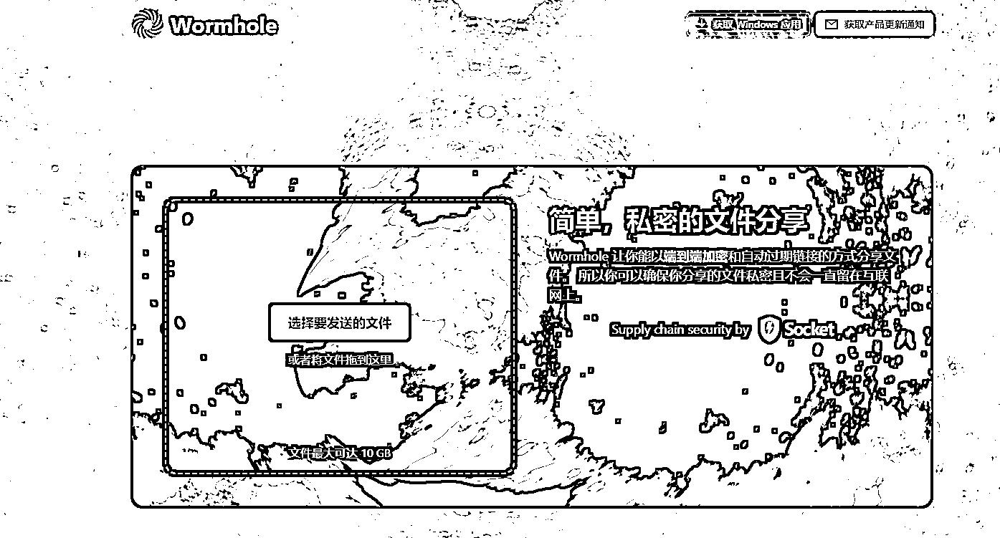
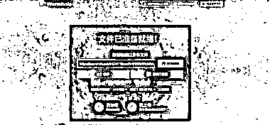

# 文件传输工具，打开就可以选择上传需要临时保存的文件或文件夹，一次可以免费上传 10GB 以内的大小文件

> 原文：[`www.yuque.com/for_lazy/xkrm14/ntrflq4emlehzkob`](https://www.yuque.com/for_lazy/xkrm14/ntrflq4emlehzkob)

作者： 壮助 

日期：2023-01-10 

点赞数：15 

文件传输工具 wormhole 一个没有任何限制的文件传输网站，打开就可以选择上传需要临时保存的文件或文件夹，一次可以免费上传 10GB 以内的大小文件。 文件上传完成后它会自动生成一个链接，点击复制链接就可以打开提取保存的文件，生成后的链接还支持分享，一些无法传输发送的文件都可以用这种方法快速分享下载。 下载速度非常快，只要点击上传文件另外一端就可以开始下载正在上传的文件，上传完即可下载完成。[Wormhole+-+Simple,+private+file+sharing](https://wormhole.app/) 

 

  

