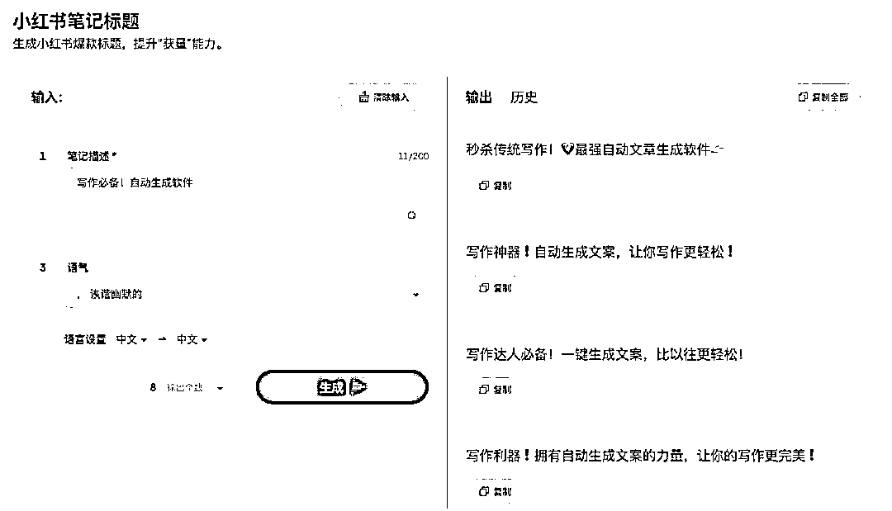
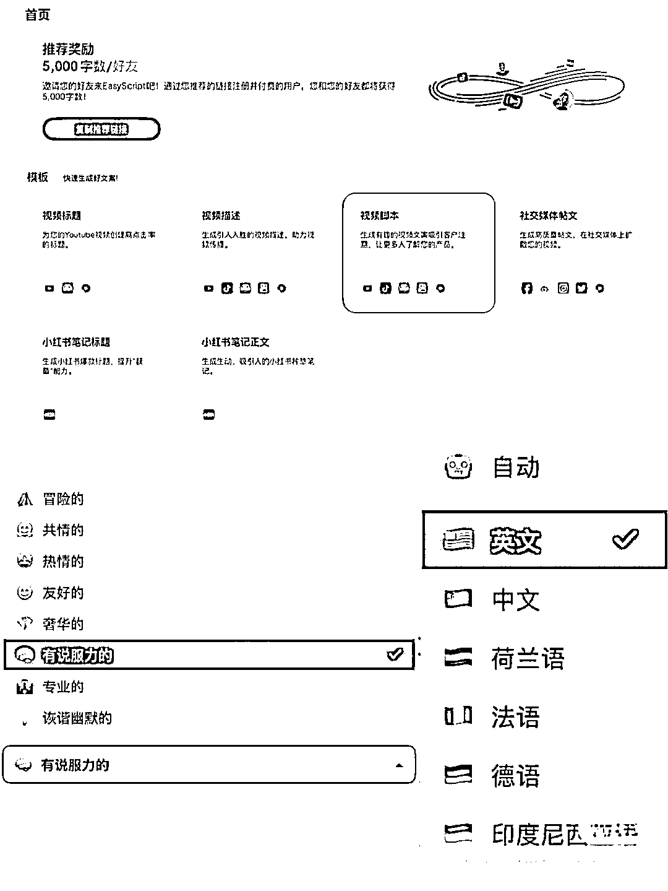

# 小红书文案神器，适合编写软广，输入产品名称和想宣传的点，便可以自动生成文案和标题

> 原文：[`www.yuque.com/for_lazy/xkrm14/ieb4lzdprfco6iwm`](https://www.yuque.com/for_lazy/xkrm14/ieb4lzdprfco6iwm)

作者： 小明同学 

日期：2023-01-10 

点赞数：16 

ai 生成标题文案！发现一款小红书文案神器 easyscript.ai，尤其适合编写软广，输入产品名称和想宣传的点，便可以自动生成文案和标题。这个工具可能不是新鲜事，但总有信息差存在，有了这个软件，我们可以怎么实操赚钱呢 1.博主.可以用这个生成，然后稍加修改，节约你的时间 2.可以找兼职帮他们写文案，比如一条 5-15 元 3.软件是部分付费的，拉人头也可以成为一个卖点，比如官网 5 元 x 字，可以用更便宜的价格收人头，然后卖给需要用这个软件的人。 

 

 

 

 

