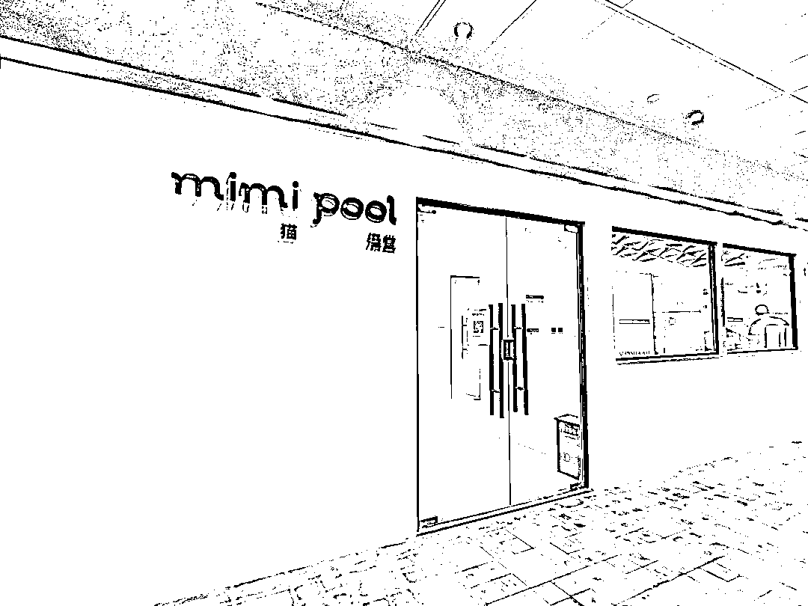
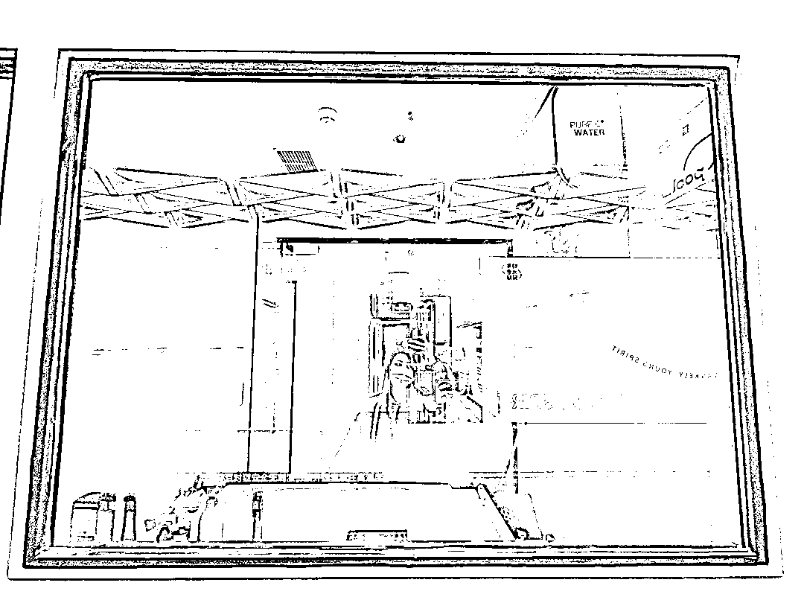
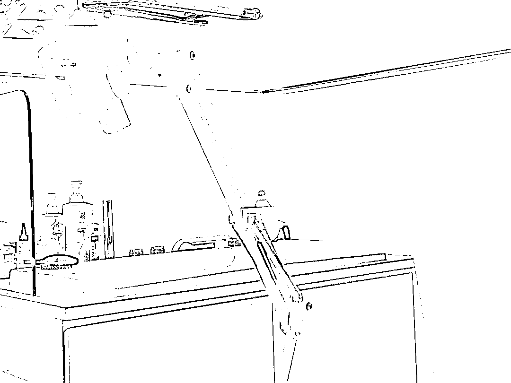
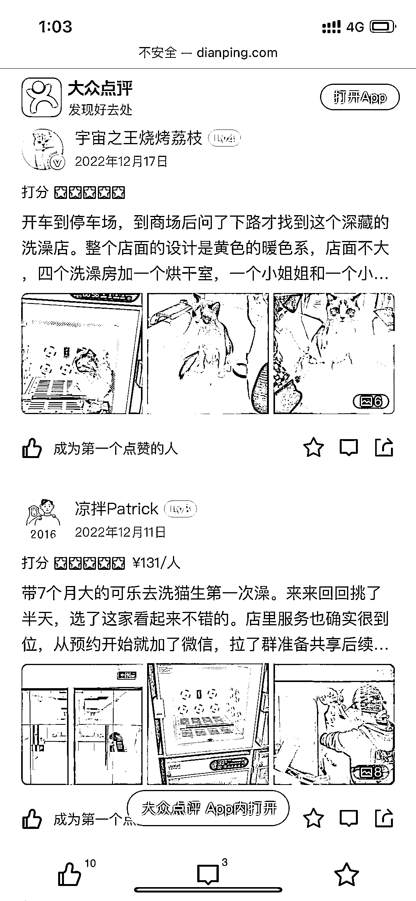
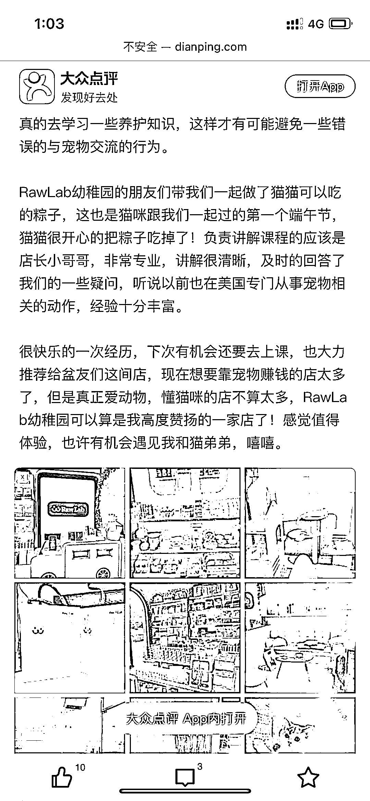

# 开在大商超里的猫澡堂

> 原文：[`www.yuque.com/for_lazy/xkrm14/rgbklcirmw7z902i`](https://www.yuque.com/for_lazy/xkrm14/rgbklcirmw7z902i)

作者： 曾丽@丽丽曾 

日期：2023-01-09 

点赞数：16 

开在大商超里的猫澡堂，第一次见，惊讶于一个给猫洗澡的澡堂，竟然能在月租金 5 位数甚至 6 位数的商场活下去？ 透过玻璃可以很好地看到里面的细节。这家店是从狗澡堂转型的，目前洗澡客单价 150 左右，还有售卖活体、产品、课程等其他服务。 它现在较稀缺，相比一般宠物店更专业、垂直，做猫舍、猫淘客群等有本地粉丝的圈友，可以给它精准导流。 未来随着宠物经济越来越火，预计此类需求会更强。 

 

 

 

 

 

 

 

 

 

