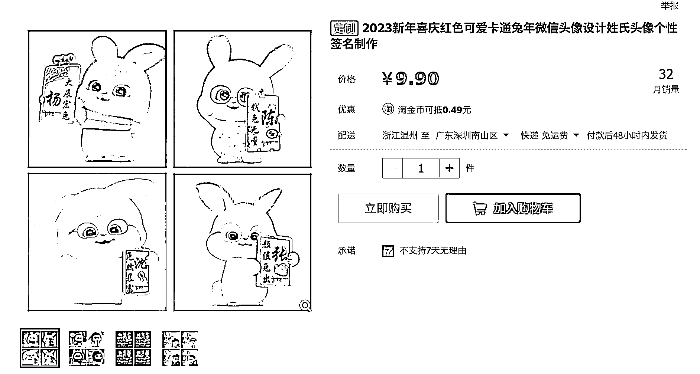

# 这套兔子图片还可以衍生很多玩法，比如代 P 头像，姓氏等

> 原文：[`www.yuque.com/for_lazy/xkrm14/adv6s0p31ynx1t5p`](https://www.yuque.com/for_lazy/xkrm14/adv6s0p31ynx1t5p)

<ne-p id="u01e9103e" data-lake-id="u01e9103e"><ne-text id="u6cb78881">作者： 姬小光</ne-text></ne-p> <ne-p id="uf7091b5a" data-lake-id="uf7091b5a"><ne-text id="u0fc8d0ef">日期：2023-01-05</ne-text></ne-p> <ne-p id="u2af9f6c2" data-lake-id="u2af9f6c2"><ne-text id="ubcc46e6b">点赞数：</ne-text><ne-text id="ud6ffea2c" ne-bold="true">27</ne-text></ne-p> <ne-hole id="u94bb063a" data-lake-id="u94bb063a"><ne-card data-card-name="hr" data-card-type="block" id="vJz9B" data-event-boundary="card"><ne-p id="u94f59182" data-lake-id="u94f59182"><ne-text id="u2cb8e8c4">这套兔子图片还可以衍生很多玩法，比如代 p 头像，姓氏等等。</ne-text></ne-p> <ne-p id="u50423b1d" data-lake-id="u50423b1d"><ne-card data-card-name="image" data-card-type="inline" id="AS5ML" data-event-boundary="card">  <ne-hole id="u87da95c2" data-lake-id="u87da95c2"><ne-card data-card-name="hr" data-card-type="block" id="Q4iJk" data-event-boundary="card"><ne-p id="ub154110a" data-lake-id="ub154110a"><ne-text id="uc47c91d8">公众号懒人找资源，懒人专属群分享</ne-text></ne-p></ne-card></ne-hole></ne-card></ne-p></ne-card></ne-hole>