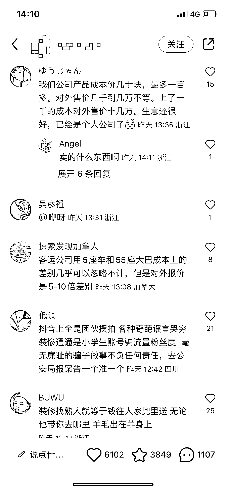

# 小红书上这种引导大家爆“行业内幕”笔记，评论增加权重，推更多流量

> 原文：[`www.yuque.com/for_lazy/xkrm14/pkfpgzqhwmhn9das`](https://www.yuque.com/for_lazy/xkrm14/pkfpgzqhwmhn9das)

作者： 多闻 

日期：2023-01-03 

点赞数：17 

小红书上这种引导大家爆“行业内幕”笔记，评论增加权重，推更多流量。 

在这些内幕的评价中也可以挖掘一些项目。 

 

 

 

 

