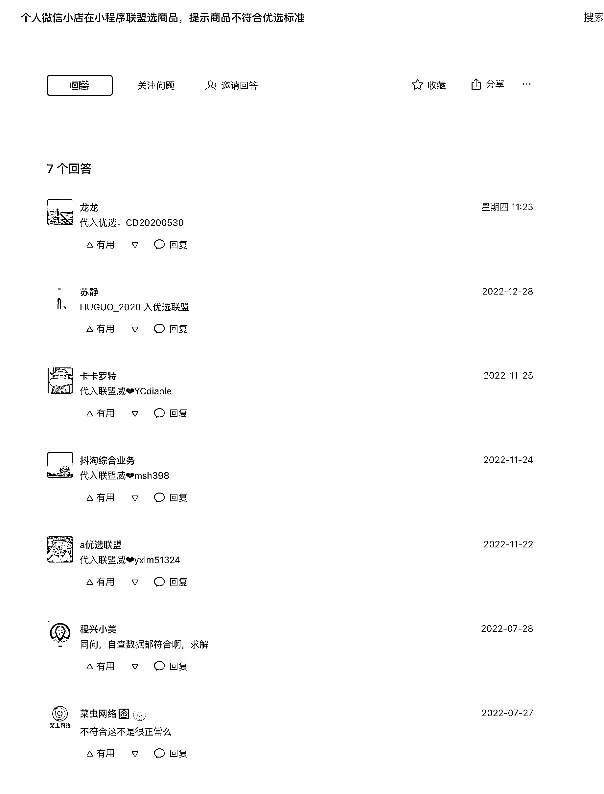

# 微信相关业务的引流洼地——微信开放社区

> 原文：[`www.yuque.com/for_lazy/xkrm14/dc6ziwf01tw3c3ux`](https://www.yuque.com/for_lazy/xkrm14/dc6ziwf01tw3c3ux)

作者： 麦洛 

日期：2023-01-03 

点赞数：37 

微信相关业务的引流洼地 

1、微信开放社区。如果是微信相关业务的问题，不论你在哪里搜索，可能最终都会导向微信开放社区的某一篇帖子 2、我们可以去搜索具体业务的关键词，例如：优选联盟 3、在该关键词的所有问题下面认认真正回答问题，并留下钩子，就会有人来加你（如图是一个很暴力的方式，很多人加，但是有违规风险） 

流量有多好呢？就这样留微信，一天能有 200 人加 

 

